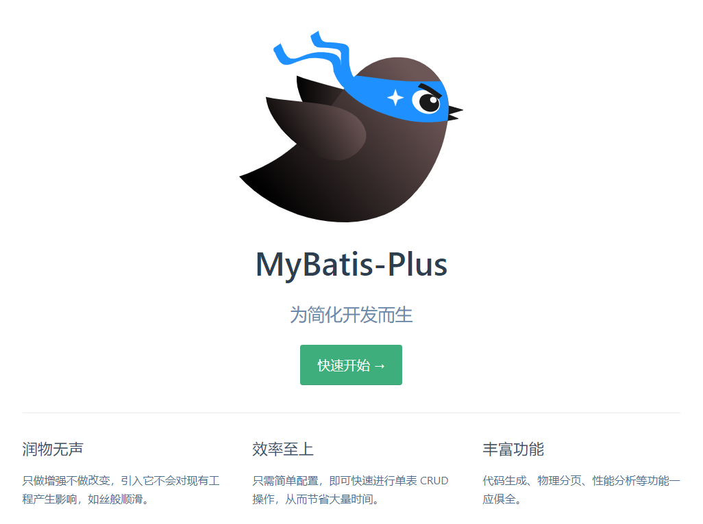
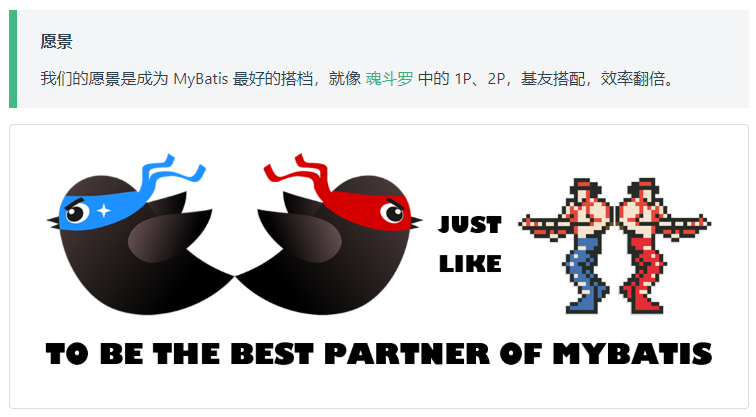

MyBatis

注：部分笔记源自网络：https://mp.weixin.qq.com/s/vy-TUFa1Rb69ekxiEYGRqw

# 什么是持久层？

```xml
一、 java三层架构

业务层（逻辑层、service层）
采用事务脚本模式。将一个业务中所有的操作封装成一个方法，同时保证方法中所有的数据库更新操作，即保证同时成功或同时失败。避免部分成功部分失败引起的数据混乱操作。

表现层（JSP）
采用MVC模式。
M称为模型，也就是实体类。用于数据的封装和数据的传输。
V为视图，也就是GUI组件，用于数据的展示。
C为控制，也就是事件，用于流程的控制。

持久层（DAO）
采用DAO模式，建立实体类和数据库表映射（ORM映射）。也就是哪个类对应哪个表，哪个属性对应哪个列。持久层的目的就是，完成对象数据和关系数据的转换。

二、SSH框架

业务层——Spring
表现层——Struts
持久层——Hibernate
三、SSM框架

业务层——Spring
表现层——SpringMVC
持久层——MyBatis
```

# 什么是mybatis？

```xml
MyBatis 是一款   优秀的持久层框架   ，它支持自定义 SQL、存储过程以及高级映射。MyBatis 免除了几乎所有的 JDBC 代码以及设置参数和获取结果集的工作。MyBatis 可以通过简单的 XML 或注解来配置和映射原始类型、接口和 Java POJO（Plain Old Java Objects，普通老式 Java 对象）为数据库中的记录。
```

mybatis3官网：https://mybatis.org/mybatis-3/zh/index.html

mybatis-plus3官网：https://mp.baomidou.com/或者https://mybatis.plus/

记住这只小鸟。

为简化开发而生···额···为偷懒而生！！！



# 一.Mybatis

```xml
注：
以往在java代码中操作数据库，需要借助JDBC，每次需要编写较长的配置代码，进行操作，目前仅试验过CURD的代码实现，繁琐且不灵活，因此首先借助mybatis。
仅从目前接手的任务来看，个人关注的重点依旧在SQL的操作上，因为IDEA的升级版本迅速，所以在项目中的mapper文件中常常会爆红一大片，此处不必紧张，根据大佬介绍，只要SQL在数据库工具中能够跑通，按照动态SQL的实现方式写入mapper中，执行起来就没啥问题。
目前仅写过简单的CURD，学识浅薄，暂记笔记以待厚积薄发。以下是截止目前2021年1月28日22:05:44，脑子中仍记得的mybatis的相关情况。待后续时间充裕，重温mybatis。
```

## 1.构建第一个MyBatis程序

### 1.导入依赖

```xml
<!--导入依赖-->
<dependencies>
    <!--mysql驱动-->
    <dependency>
        <groupId>mysql</groupId>
        <artifactId>mysql-connector-java</artifactId>
        <version>*.*.*</version>
    </dependency>
    <!--mybatis-->
    <dependency>
        <groupId>org.mybatis</groupId>
        <artifactId>mybatis</artifactId>
        <version>*.*.*</version>
    </dependency>
    <!--junit-->
    <dependency>
        <groupId>junit</groupId>
        <artifactId>junit</artifactId>
        <version>*.*.*</version>
    </dependency>
</dependencies>
```

### 2.编写Mybatis配置文件

```xml
<?xml version="1.0" encoding="UTF-8" ?>
<!DOCTYPE configuration
        PUBLIC "-//mybatis.org//DTD Config 3.0//EN"
        "http://mybatis.org/dtd/mybatis-3-config.dtd">
<!--configuration核心配置文件-->
<configuration>
    <!--environments配置环境组-->
    <!--default默认环境-->
    <environments default="development">
        <!--environment单个环境-->
        <environment id="development">
            <!--transactionManager配置事务管理器-->
            <transactionManager type="JDBC"/>
            <!--配置连接池-->
            <dataSource type="POOLED">
                <property name="driver" value="com.mysql.jdbc.Driver"/>
                <property name="url" value="jdbc:mysql://localhost:3306/mybatis?useSSL=true&amp;useUnicode=true&amp;characterEncoding=UFT-8"/>
                <property name="username" value="root"/>
                <property name="password" value="Cc105481"/>
            </dataSource>
        </environment>
    </environments>

</configuration>
```

### 3.编写mybatis工具类用于获取sqlSessionfactory

```xml
import org.apache.ibatis.io.Resources;
import org.apache.ibatis.session.SqlSession;
import org.apache.ibatis.session.SqlSessionFactory;
import org.apache.ibatis.session.SqlSessionFactoryBuilder;
import java.io.IOException;
import java.io.InputStream;

public class MybatisUtils {

   private static SqlSessionFactory sqlSessionFactory;

   static {
       try {
           String resource = "mybatis-config.xml";
           InputStream inputStream = Resources.getResourceAsStream(resource);
           sqlSessionFactory = new SqlSessionFactoryBuilder().build(inputStream);
      } catch (IOException e) {
           e.printStackTrace();
      }
  }

   //获取SqlSession连接
   public static SqlSession getSession(){
       return sqlSessionFactory.openSession();
}
```

### 4.编写实体类

### 5.CURD

### 6.ResultMap及分页

### 7.使用注解开发

### 8.一对多/多对一处理

### 10.动态SQL

### 11.缓存

# 二.MyBatis-plus

### 1.什么是mybatis-plus？

```xml
MyBatis-Plus (opens new window)（简称 MP）是一个 MyBatis (opens new window)的增强工具，在 MyBatis 的基础上只做增强不做改变，为简化开发、提高效率而生。
```



### 2.特性

- **无侵入**：只做增强不做改变，引入它不会对现有工程产生影响，如丝般顺滑
- **损耗小**：**启动即会自动注入基本 CURD，性能基本无损耗，直接面向对象操作**
- **强大的 CRUD 操作**：内置通用 Mapper、通用 Service，仅仅通过少量配置即可实现单表大部分 CRUD 操作，更有强大的条件构造器，满足各类使用需求
- **支持 Lambda 形式调用**：通过 Lambda 表达式，方便的编写各类查询条件，无需再担心字段写错
- **支持主键自动生成**：支持多达 4 种主键策略（内含分布式唯一 ID 生成器 - Sequence），可自由配置，完美解决主键问题
- **支持 ActiveRecord 模式**：支持 ActiveRecord 形式调用，实体类只需继承 Model 类即可进行强大的 CRUD 操作
- **支持自定义全局通用操作**：支持全局通用方法注入（ Write once, use anywhere ）
- **内置代码生成器**：采用代码或者 Maven 插件可快速生成 Mapper 、 Model 、 Service 、 Controller 层代码，支持模板引擎，更有超多自定义配置等您来使用
- **内置分页插件**：**基于 MyBatis 物理分页，开发者无需关心具体操作，配置好插件之后，写分页等同于普通 List 查询**
- **分页插件支持多种数据库**：支持 MySQL、MariaDB、Oracle、DB2、H2、HSQL、SQLite、Postgre、SQLServer 等多种数据库
- **内置性能分析插件**：可输出 Sql 语句以及其执行时间，建议开发测试时启用该功能，能快速揪出慢查询
- **内置全局拦截插件**：提供全表 delete 、 update 操作智能分析阻断，也可自定义拦截规则，预防误操作


