MyBatis

注：部分笔记源自网络：https://mp.weixin.qq.com/s/vy-TUFa1Rb69ekxiEYGRqw

# 什么是持久层？

```xml
一、 java三层架构

业务层（逻辑层、service层）
采用事务脚本模式。将一个业务中所有的操作封装成一个方法，同时保证方法中所有的数据库更新操作，即保证同时成功或同时失败。避免部分成功部分失败引起的数据混乱操作。

表现层（JSP）
采用MVC模式。
M称为模型，也就是实体类。用于数据的封装和数据的传输。
V为视图，也就是GUI组件，用于数据的展示。
C为控制，也就是事件，用于流程的控制。

持久层（DAO）
采用DAO模式，建立实体类和数据库表映射（ORM映射）。也就是哪个类对应哪个表，哪个属性对应哪个列。持久层的目的就是，完成对象数据和关系数据的转换。

二、SSH框架

业务层——Spring
表现层——Struts
持久层——Hibernate
三、SSM框架

业务层——Spring
表现层——SpringMVC
持久层——MyBatis
```

# 什么是mybatis？

```xml
MyBatis 是一款   优秀的持久层框架   ，它支持自定义 SQL、存储过程以及高级映射。MyBatis 免除了几乎所有的 JDBC 代码以及设置参数和获取结果集的工作。MyBatis 可以通过简单的 XML 或注解来配置和映射原始类型、接口和 Java POJO（Plain Old Java Objects，普通老式 Java 对象）为数据库中的记录。
```

mybatis3官网：https://mybatis.org/mybatis-3/zh/index.html

mybatis-plus3官网：https://mp.baomidou.com/或者https://mybatis.plus/

记住这只小鸟。

为简化开发而生···额···为偷懒而生！！！


# 一.Mybatis

```xml
注：
以往在java代码中操作数据库，需要借助JDBC，每次需要编写较长的配置代码，进行操作，目前仅试验过CURD的代码实现，繁琐且不灵活，因此首先借助mybatis。
仅从目前接手的任务来看，个人关注的重点依旧在SQL的操作上，因为IDEA的升级版本迅速，所以在项目中的mapper文件中常常会爆红一大片，此处不必紧张，根据大佬介绍，只要SQL在数据库工具中能够跑通，按照动态SQL的实现方式写入mapper中，执行起来就没啥问题。
目前仅写过简单的CURD，学识浅薄，暂记笔记以待厚积薄发。以下是截止目前2021年1月28日22:05:44，脑子中仍记得的mybatis的相关情况。待后续时间充裕，重温mybatis。
```

## 1.构建第一个MyBatis程序

### 1.导入依赖

```xml
<!--导入依赖-->
<dependencies>
    <!--mysql驱动-->
    <dependency>
        <groupId>mysql</groupId>
        <artifactId>mysql-connector-java</artifactId>
        <version>*.*.*</version>
    </dependency>
    <!--mybatis-->
    <dependency>
        <groupId>org.mybatis</groupId>
        <artifactId>mybatis</artifactId>
        <version>*.*.*</version>
    </dependency>
    <!--junit-->
    <dependency>
        <groupId>junit</groupId>
        <artifactId>junit</artifactId>
        <version>*.*.*</version>
    </dependency>
</dependencies>
```

### 2.编写Mybatis配置文件

```xml
<?xml version="1.0" encoding="UTF-8" ?>
<!DOCTYPE configuration
        PUBLIC "-//mybatis.org//DTD Config 3.0//EN"
        "http://mybatis.org/dtd/mybatis-3-config.dtd">
<!--configuration核心配置文件-->
<configuration>
    <!--environments配置环境组-->
    <!--default默认环境-->
    <environments default="development">
        <!--environment单个环境-->
        <environment id="development">
            <!--transactionManager配置事务管理器-->
            <transactionManager type="JDBC"/>
            <!--配置连接池-->
            <dataSource type="POOLED">
                <property name="driver" value="com.mysql.jdbc.Driver"/>
                <property name="url" value="jdbc:mysql://localhost:3306/mybatis?useSSL=true&amp;useUnicode=true&amp;characterEncoding=UFT-8"/>
                <property name="username" value="root"/>
                <property name="password" value="Cc105481"/>
            </dataSource>
        </environment>
    </environments>

</configuration>
```

### 3.编写mybatis工具类用于获取sqlSessionfactory

```xml
import org.apache.ibatis.io.Resources;
import org.apache.ibatis.session.SqlSession;
import org.apache.ibatis.session.SqlSessionFactory;
import org.apache.ibatis.session.SqlSessionFactoryBuilder;
import java.io.IOException;
import java.io.InputStream;

public class MybatisUtils {

   private static SqlSessionFactory sqlSessionFactory;

   static {
       try {
           String resource = "mybatis-config.xml";
           InputStream inputStream = Resources.getResourceAsStream(resource);
           sqlSessionFactory = new SqlSessionFactoryBuilder().build(inputStream);
      } catch (IOException e) {
           e.printStackTrace();
      }
  }

   //获取SqlSession连接
   public static SqlSession getSession(){
       return sqlSessionFactory.openSession();
}
```

### 4.编写实体类

### 5.CURD

### 6.ResultMap及分页

### 7.使用注解开发

### 8.一对多/多对一处理

### 10.动态SQL

### 11.缓存

# 二.MyBatis-plus

### 1.什么是mybatis-plus？

```xml
MyBatis-Plus (opens new window)（简称 MP）是一个 MyBatis (opens new window)的增强工具，在 MyBatis 的基础上只做增强不做改变，为简化开发、提高效率而生。
```


### 2.特性

- **无侵入**：只做增强不做改变，引入它不会对现有工程产生影响，如丝般顺滑
- **损耗小**：**启动即会自动注入基本 CURD，性能基本无损耗，直接面向对象操作**
- **强大的 CRUD 操作**：内置通用 Mapper、通用 Service，仅仅通过少量配置即可实现单表大部分 CRUD 操作，更有强大的条件构造器，满足各类使用需求
- **支持 Lambda 形式调用**：通过 Lambda 表达式，方便的编写各类查询条件，无需再担心字段写错
- **支持主键自动生成**：支持多达 4 种主键策略（内含分布式唯一 ID 生成器 - Sequence），可自由配置，完美解决主键问题
- **支持 ActiveRecord 模式**：支持 ActiveRecord 形式调用，实体类只需继承 Model 类即可进行强大的 CRUD 操作
- **支持自定义全局通用操作**：支持全局通用方法注入（ Write once, use anywhere ）
- **内置代码生成器**：采用代码或者 Maven 插件可快速生成 Mapper 、 Model 、 Service 、 Controller 层代码，支持模板引擎，更有超多自定义配置等您来使用
- **内置分页插件**：**基于 MyBatis 物理分页，开发者无需关心具体操作，配置好插件之后，写分页等同于普通 List 查询**
- **分页插件支持多种数据库**：支持 MySQL、MariaDB、Oracle、DB2、H2、HSQL、SQLite、Postgre、SQLServer 等多种数据库
- **内置性能分析插件**：可输出 Sql 语句以及其执行时间，建议开发测试时启用该功能，能快速揪出慢查询
- **内置全局拦截插件**：提供全表 delete 、 update 操作智能分析阻断，也可自定义拦截规则，预防误操作

### 3.快速开始

#### 1.依赖导入：

```xml
<!--mysql-->
<dependency>
    <groupId>mysql</groupId>
    <artifactId>mysql-connector-java</artifactId>
</dependency>
<!--lombok-->
<dependency>
    <groupId>org.projectlombok</groupId>
    <artifactId>lombok</artifactId>
</dependency>
<!--mybatis-plus-->
<dependency>
    <groupId>com.baomidou</groupId>
    <artifactId>mybatis-plus-boot-starter</artifactId>
    <version>3.0.5</version>
</dependency>
```

#### 2.配置:连接数据库

```xml
application.yml

# mysql
#spring.datasource.username=root
#spring.datasource.password=root
#spring.datasource.url=jdbc:mysql://localhost:3306/mybatis_plus?userSSL=true&useUnicode=true&characterEncoding=UTF-8&serverTimezone=UTC
#spring.datasource.driver-class-name=com.mysql.cj.jdbc.Driver

spring:
  datasource:
    username: root
    password: 123456
    url: jdbc:mysql://localhost:3306/user?userSSL=true&useUnicode=true&characterEncoding=UTF-8&serverTimezone=UTC
    driver-class-name: com.mysql.cj.jdbc.Driver
```

#### 3.编写Mapper继承BaseMapper

### 4.配置日志

```xml
#配置日志
mybatis-plus:
  configuration:
    log-impl: org.apache.ibatis.logging.stdout.StdOutImpl
```

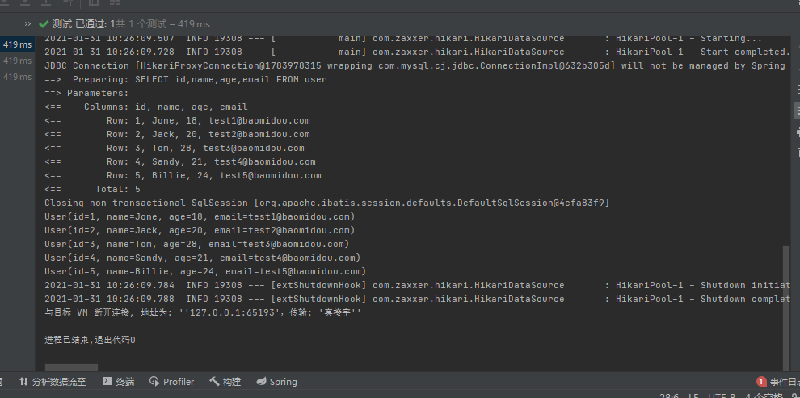

### 5.CRUD扩展

##### 1.insert

```java
@Test
public void addUser(){
  User user = new User();
  //我们并没有setId，而是自动生成了Id
  user.setName("wangPeng");
  user.setAge(81);
  user.setEmail("1344471553@qq.com");
  userMapper.insert(user);
}
```

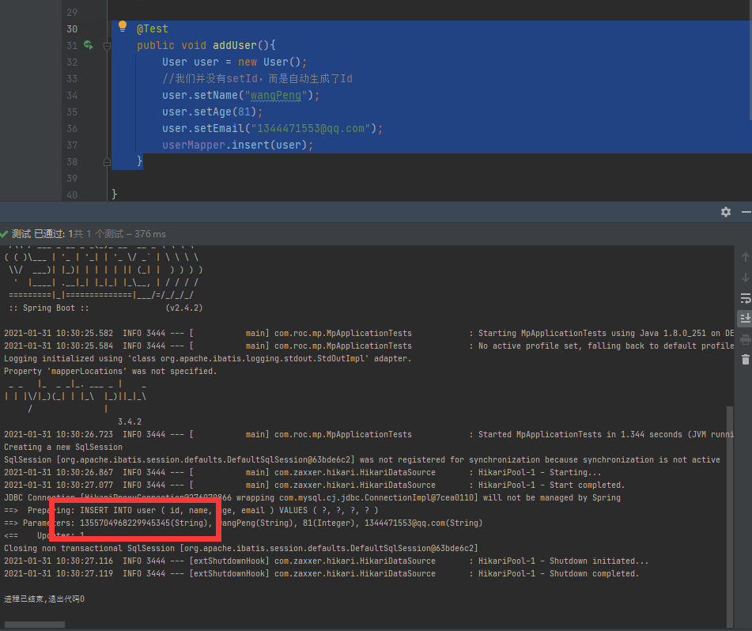

**主键生成策略**

分布式系统唯一id生成:https://www.cnblogs.com/haoxinyue/p/5208136.html

**雪花算法**😦**Twitter的snowflake算法**)

```xml
snowflake是Twitter开源的分布式ID生成算法，结果是一个long型的ID。其核心思想是：使用41bit作为毫秒数，10bit作为机器的ID（5个bit是数据中心，5个bit的机器ID），12bit作为毫秒内的流水号（意味着每个节点在每毫秒可以产生 4096 个 ID），最后还有一个符号位，永远是0.可以保证几乎全球唯一
```

在实体类上需要自增的主键上加上注解

```java
@Data
@AllArgsConstructor
@NoArgsConstructor
public class User {

    @TableId(type = IdType.AUTO)
    private Integer id;

    private String name;
    private Integer age;
    private String email;
}
```

@TableId()的其他属性

```java
    AUTO(0),//数据库ID自增  
    NONE(1),//该类型为未设置主键类型      
    INPUT(2),//用户输入ID
      		 //该类型可以通过自己注册自动填充插件进行填充  
    
//以下3种类型、只有当插入对象ID 为空，才自动填充。     
    ID_WORKER(3),//全局唯一ID (idWorker)      
    UUID(4),//全局唯一ID (UUID)          
    ID_WORKER_STR(5);//字符串全局唯一ID (idWorker 的字符串表示)    
```

##### 2.update

```java
@Test
public void update(){
  User user = new User();
  //我们并没有setId，而是自动生成了Id
  user.setId(6);
  user.setName("wangyufei");
  user.setAge(18);
  user.setEmail("1344471553@qq.com");
  userMapper.updateById(user);
}
```

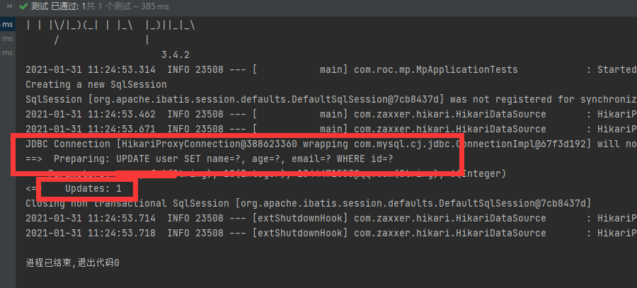

### 自动填充：源自官网：https://mp.baomidou.com/guide/auto-fill-metainfo.html

```xml
创建时间 . 修改时间! 这些个操作都是自动化完成的,我们不希望手动更新!

阿里巴巴开发手册:所有的数据库表:gmt_create .gmt_modified几乎所有的表都要配置上!而且需要自动化!
```

更新表结构

```java
CREATE TABLE user
(
    id BIGINT(20) NOT NULL COMMENT '主键ID' auto_increment,
    name VARCHAR(30) NULL DEFAULT NULL COMMENT '姓名',
    age INT(11) NULL DEFAULT NULL COMMENT '年龄',
    email VARCHAR(50) NULL DEFAULT NULL COMMENT '邮箱',
    create_time datetime DEFAULT  CURRENT_TIMESTAMP,
    update_time datetime ON UPDATE  CURRENT_TIMESTAMP,
    PRIMARY KEY (id)
);
```

更新对应实体类

```java
@Data
@AllArgsConstructor
@NoArgsConstructor
public class User {

    @TableId(type = IdType.AUTO)
    private Integer id;

    private String name;
    private Integer age;
    private String email;
    private Date createTime;
    private Date updateTime;

}
```

### 6.乐观锁/悲观锁：https://www.bilibili.com/video/BV17E411N7KN?p=8&spm_id_from=pageDriver

```xml
乐观锁: 顾名思义十分乐观,他总是认为不会出现问题,无论干什么都不去上锁!如果出现了问题,再次更新值测试

悲观锁;顾名思义十分悲观,他总是认为出现问题,无论干什么都会上锁!再去操作!
```

当要更新一条记录的时候，希望这条记录没有被别人更新
乐观锁实现方式：

> - 取出记录时，获取当前version
> - 更新时，带上这个version
> - 执行更新时， set version = newVersion where version = oldVersion
> - 如果version不对，就更新失败

乐观锁/悲观锁/自旋锁/JUC······

### 7.查询操作

#### 1.根据ID查询用户

```java
@Test
public void selectUserById(){
  User user = userMapper.selectById(1);
  System.out.println(user);
}
```

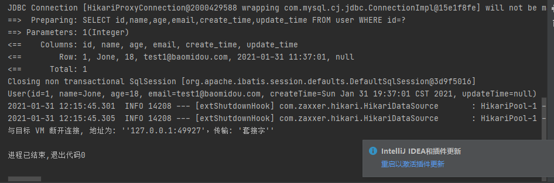

#### 2.查询用户列表

```java
@Test
public void selectUserList(){
  List<User> userList = userMapper.selectList(null);
  userList.forEach(System.out::println);
}
```

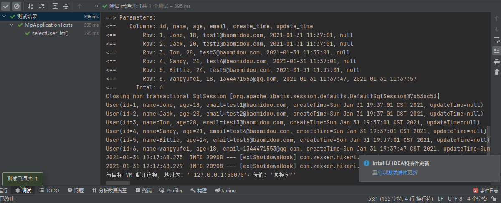

#### 3.查询部分用户

```java
@Test
public void selectUserByIds(){
  List<User> userList = userMapper.selectBatchIds(Arrays.asList(1, 2, 3));
  userList.forEach(System.out::println);
}
```

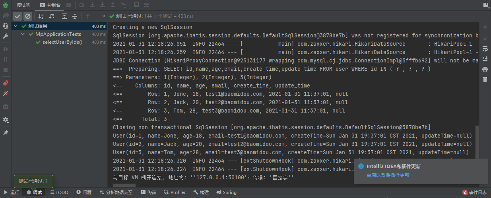

#### 4.使用map进行条件查询

```java
@Test
public void setUserByMap(){
  HashMap<String, Object> map = new HashMap<>();
  map.put("name","wangyufei");
  List<User> userList = userMapper.selectByMap(map);
  userList.forEach(System.out::println);
}
```

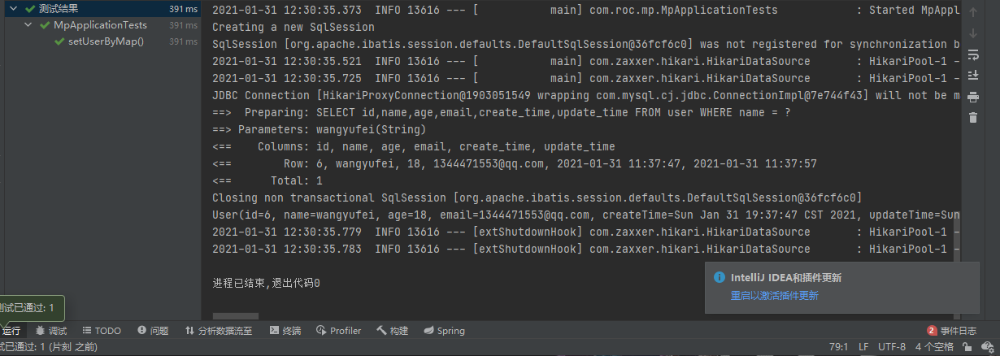

### 8.分页查询

#### 1.传统的使用limit分页

#### 2.pageHelper第三方插件

#### 3.MP内置分页插件

官网：https://mp.baomidou.com/guide/page.html

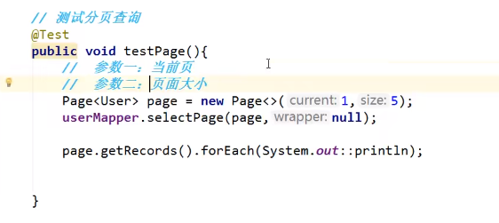

### 9.删除操作

#### 1.根据Id删除

```java
@Test
public void deleteById(){
  userMapper.deleteById(6);
}
```

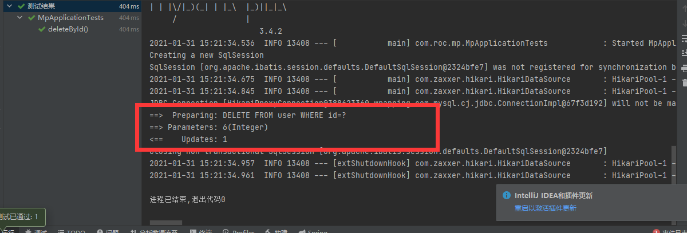

#### 2.批量删除

```java
@Test
public void deleteByBatchId(){
  userMapper.deleteBatchIds(Arrays.asList(1, 2, 3));
}
```

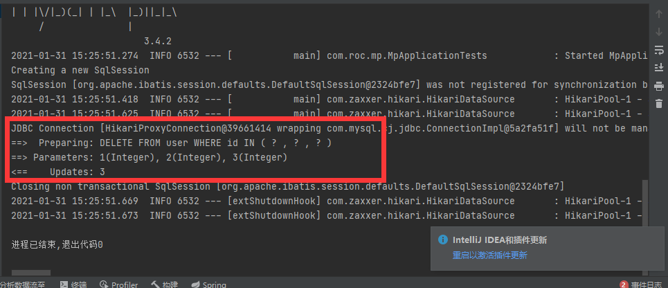

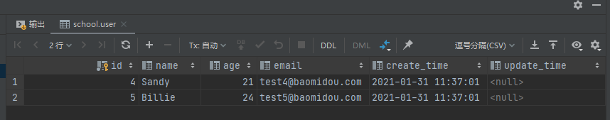

#### 3.通过map删除

```java
@Test
public void deleteByMap(){
  HashMap<String, Object> map = new HashMap<>();
  map.put("name","Sandy");
  userMapper.deleteByMap(map);
}
```

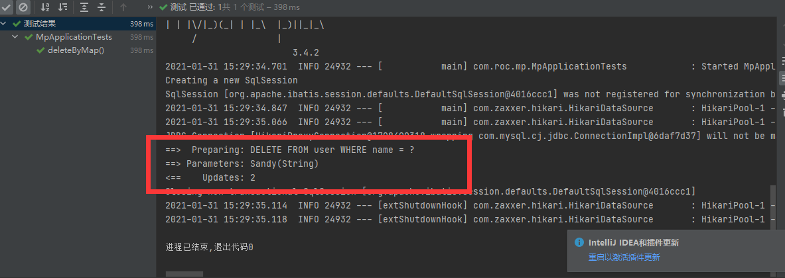

### 10.逻辑删除/物理删除

#### 1.更改表结构

```mysql
CREATE TABLE user
(
    id BIGINT(20) NOT NULL COMMENT '主键ID' auto_increment,
    name VARCHAR(30) NULL DEFAULT NULL COMMENT '姓名',
    age INT(11) NULL DEFAULT NULL COMMENT '年龄',
    email VARCHAR(50) NULL DEFAULT NULL COMMENT '邮箱',
    create_time datetime DEFAULT  CURRENT_TIMESTAMP,
    update_time datetime ON UPDATE  CURRENT_TIMESTAMP,
    deleted int(20) default '0',
    PRIMARY KEY (id)
);
```

#### 2.更改实体类

```java
@Data
@AllArgsConstructor
@NoArgsConstructor
public class User {

    @TableId(type = IdType.AUTO)
    private Integer id;

    private String name;
    private Integer age;
    private String email;
    private Date createTime;
    private Date updateTime;

    @TableLogic
    private Integer deleted;
}
```

#### 3.实际业务中删除其实为更新操作，将deleted改为“已被删除状态”。

### 11.性能分析插件

MP提供一种性能分析插件：https://mp.baomidou.com/guide/p6spy.html

狂神：https://www.bilibili.com/video/BV17E411N7KN?p=13&spm_id_from=pageDriver

1.导入插件

```xml
<dependency>
    <groupId>p6spy</groupId>
    <artifactId>p6spy</artifactId>
    <version>3.8.7</version>
</dependency>
```

2.配置插件

### 12.条件构造器Wrapper

官网：https://mp.baomidou.com/guide/wrapper.html

B站狂神：https://www.bilibili.com/video/BV17E411N7KN?p=14&spm_id_from=pageDriver

#### 1.通过Wrapper构造条件进行查询

```java
@Test
//查询name不为空，且邮箱不为空，年龄大于12岁的用户
public void selectByWrapper(){
    QueryWrapper<User> queryWrapper = new QueryWrapper<>();
    queryWrapper
            .isNotNull("name")
            .isNotNull("email")
            .ge("age",12);

    userMapper.selectList(queryWrapper).forEach(System.out::println);
}
```

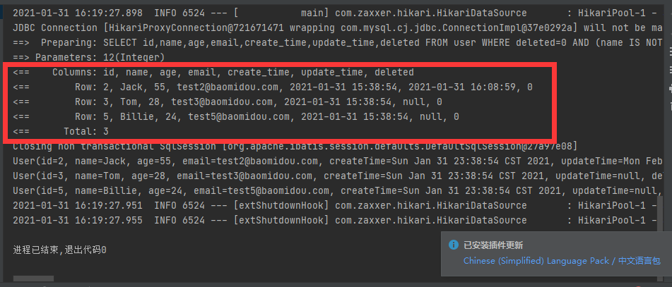

```mysql
SELECT id,name,age,email,create_time,update_time,deleted FROM user WHERE deleted=0 AND (name IS NOT NULL AND email IS NOT NULL AND age >= ?)
```

#### 2.通过Wrapper构造模糊查询

```java
@Test
public void selectByName(){
    QueryWrapper<User> queryWrapper = new QueryWrapper<>();
    queryWrapper.eq("name","kuangshengshuo");
    userMapper.selectList(queryWrapper);    
}
```

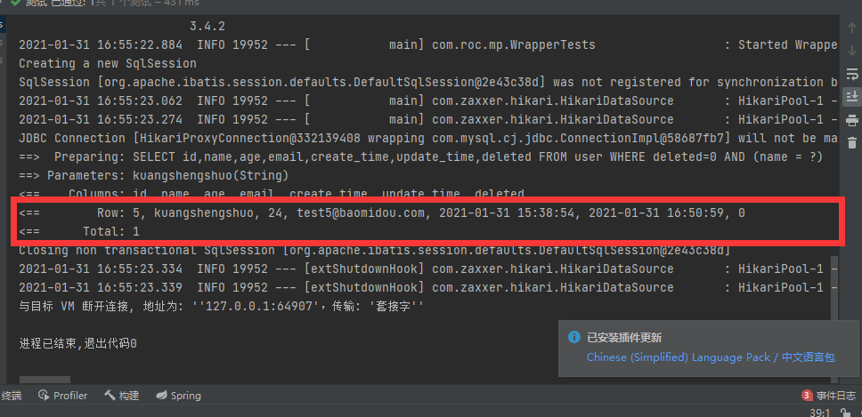

```mysql
SELECT id,name,age,email,create_time,update_time,deleted FROM user WHERE deleted=0 AND (name = ?)
```

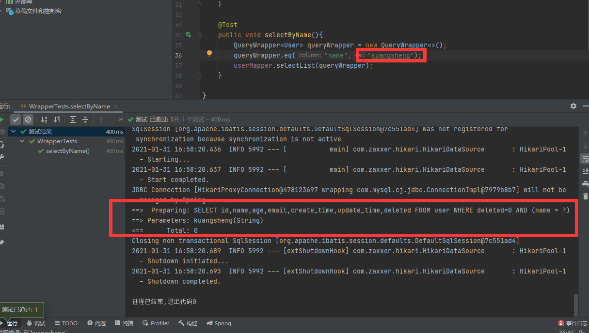

#### 3.通过wrapper构造between···and···

```java
@Test
public void selectByBetween(){
    QueryWrapper<User> queryWrapper = new QueryWrapper<>();
    queryWrapper.between("age","10","30");
    userMapper.selectList(queryWrapper).forEach(System.out::println);
    Integer count = userMapper.selectCount(queryWrapper);
    System.out.println(count);
}
```

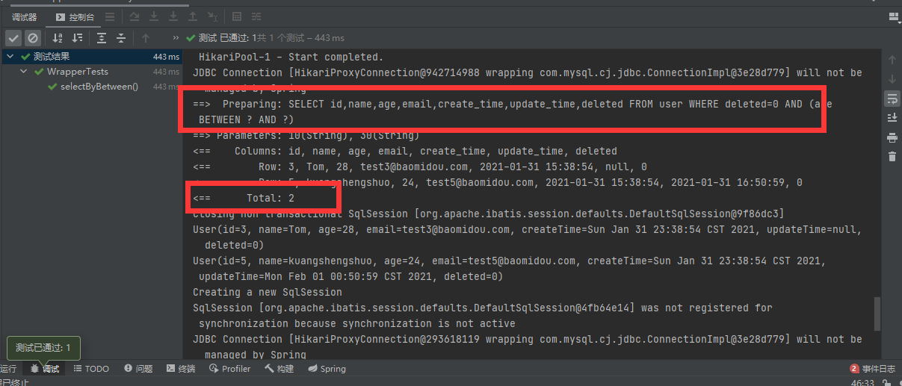

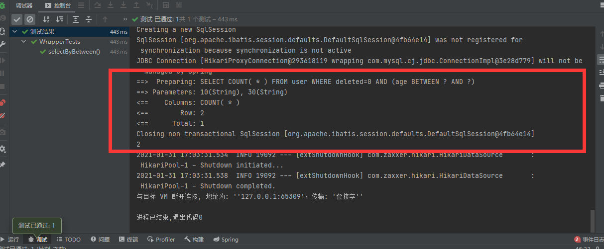

#### 4.通过wrapper构造模糊查询

```java
@Test
public void selectByLike(){
    QueryWrapper<User> queryWrapper = new QueryWrapper<>();
    queryWrapper.notLike("name","e");
    List<Map<String, Object>> maps = userMapper.selectMaps(queryWrapper);
    maps.forEach(System.out::println);
}
```

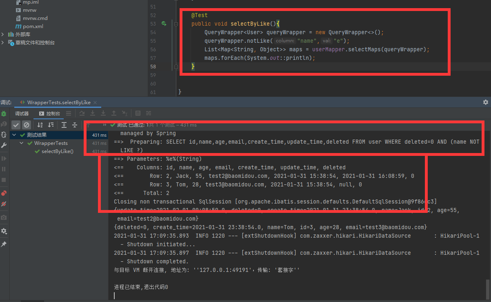

#### 5.嵌入SQL进行查询

```java
@Test
public void selectBySql(){
    QueryWrapper<User> queryWrapper = new QueryWrapper<>();
    queryWrapper.inSql("id","select id from user where id <5");
    List<Object> objects = userMapper.selectObjs(queryWrapper);
    objects.forEach(System.out::println);
}
```

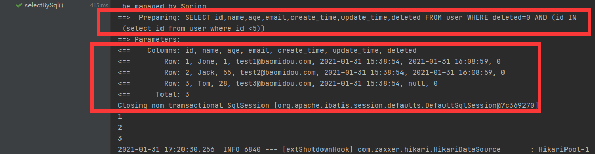

#### 6.通过Id进行降序排序

```java
@Test
public void selectByOrder(){
    QueryWrapper<User> queryWrapper = new QueryWrapper<>();
    queryWrapper.orderByDesc("Id");
    List<User> userList = userMapper.selectList(queryWrapper);
    userList.forEach(System.out::println);
}
```

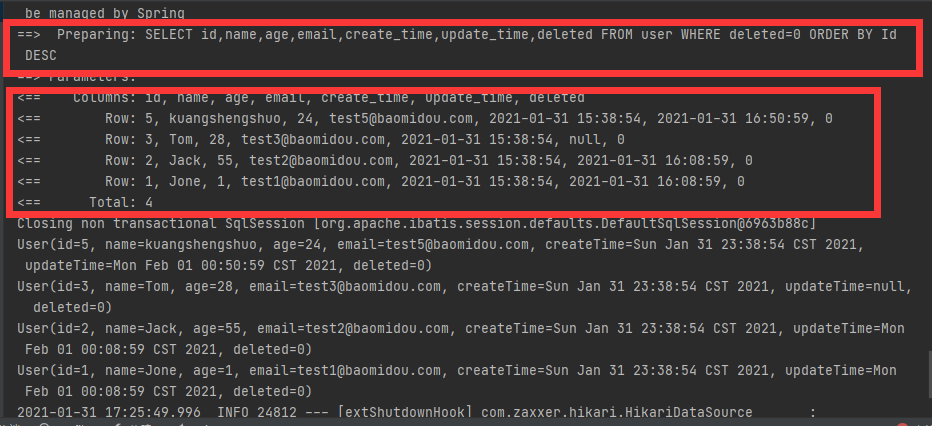

### 13.代码自动生成器mybatis  generator

官方：https://mp.baomidou.com/guide/generator.html#使用教程

狂神：https://www.bilibili.com/video/BV17E411N7KN?p=16&spm_id_from=pageDriver

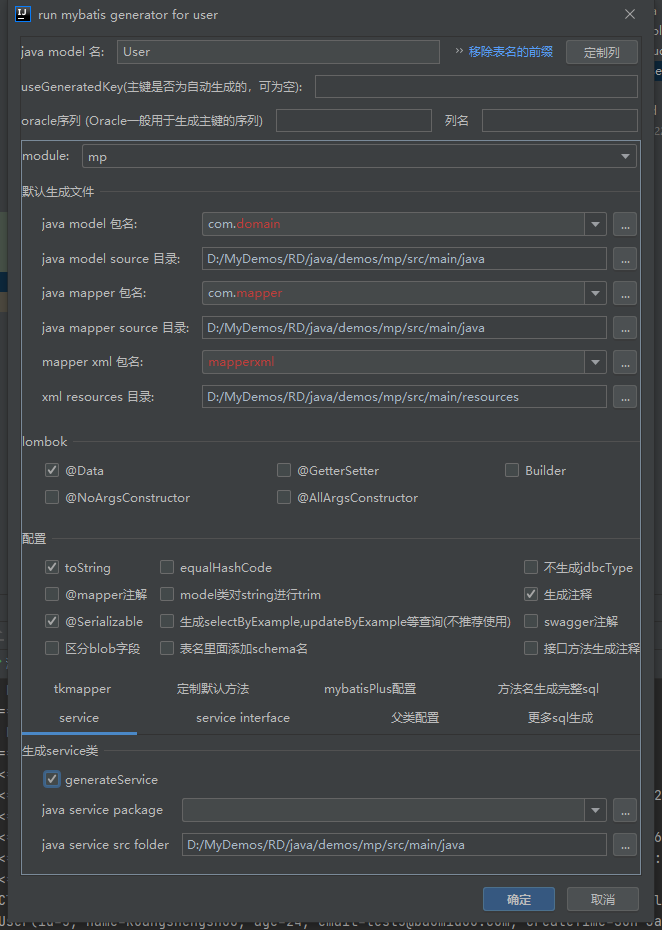

