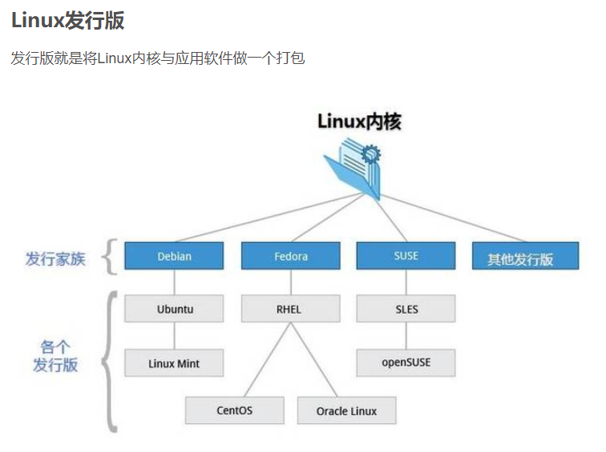
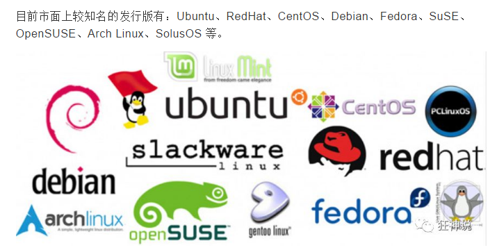
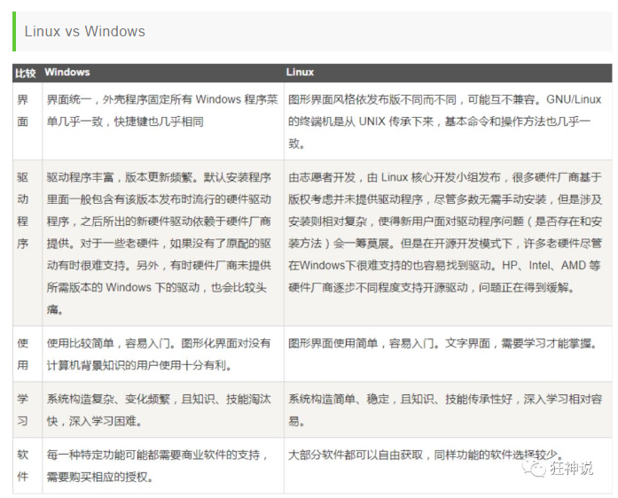
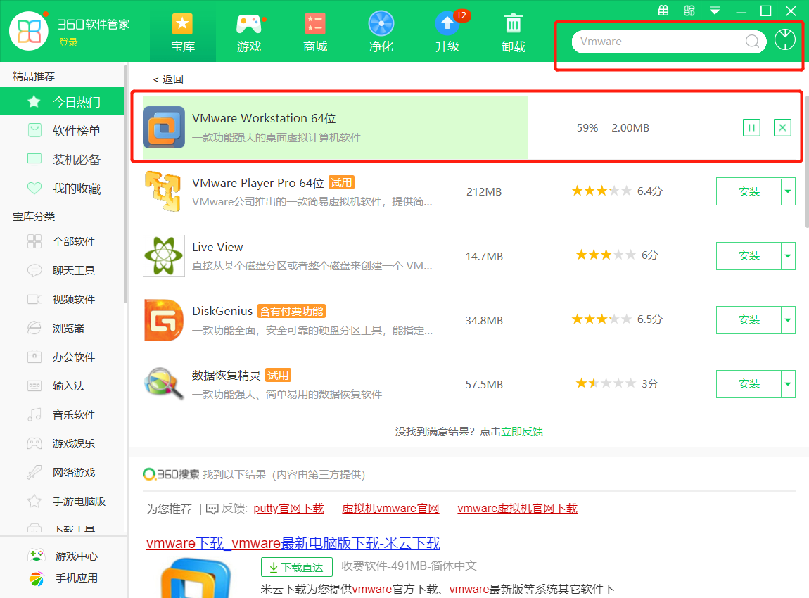
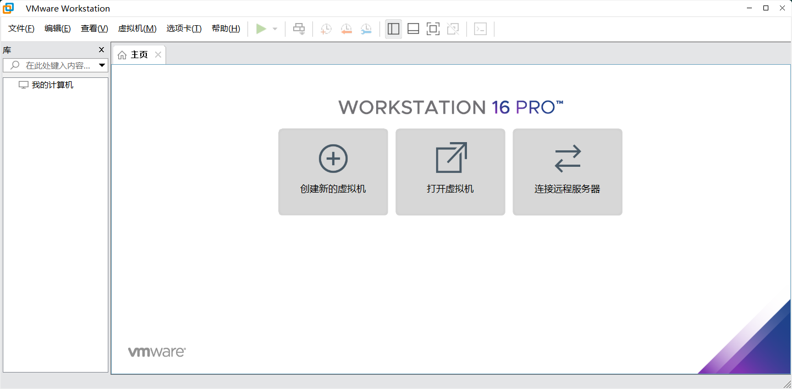

# Linux

## 为什么要学Linux？

```xml
在服务器端，在开发领域Linux是越来越受欢迎。
java程序需要自己打包上传到Linux服务器上进行部署
```

# 1.linux简介

## 1.什么是Linux?

```xml
Linux内核最初只是由芬兰人林纳斯.托瓦兹( Linus Torvalds )在赫尔辛基大学上学时出于个人爱好而编写的。
 Linux是一套免费使用和自由传播的类Unix操作系统,是一个基于POSIX (可移植操作系统接口)和UNIX的多用户、多任务、支持多线程和多CPU的操作系统。
 Linux能运行主要的UNIX工具软件、应用程序和网络协议。它支持32位和64位硬件。Linux 继承了Unix以网络为核心的设计思想，是一个性能稳定的多用户网络操作系统。
```

## 2.Linux版本





## 3.Linux与windows的区别



# 2.Linux环境搭建

> 安装CentOS（虚拟机安装，耗资源）

1、可以通过镜像进行安装！

2、可以使用我已经制作好的镜像！视频中讲解了该种方式！

3、安装 VMware 虚拟机软件，然后打开我们的镜像即可使用！

**360软件管家一键式安装：**





> 购买云服务器（推荐）

虚拟机安装后占用空间，也会有些卡顿，我们作为程序员其实可以选择购买一台自己的服务器，这样的话更加接近真实线上工作；

1、阿里云购买服务器：https://www.aliyun.com/minisite/goods?userCode=0phtycgr

2、购买完毕后，获取服务器的ip地址，重置服务器密码，就可以远程登录了

3、下载 xShell 工具，进行远程连接使用！连接成功效果如下：

# 3.Linux能做什么？