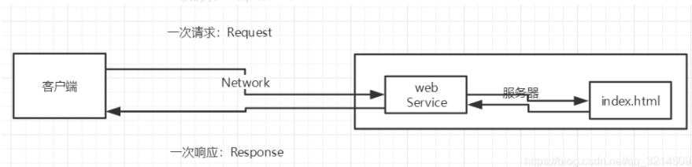
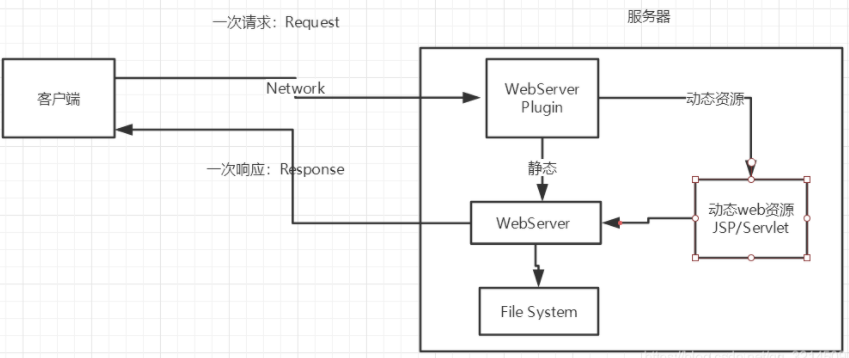
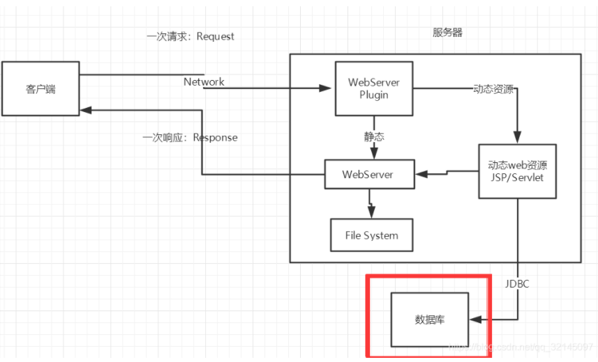
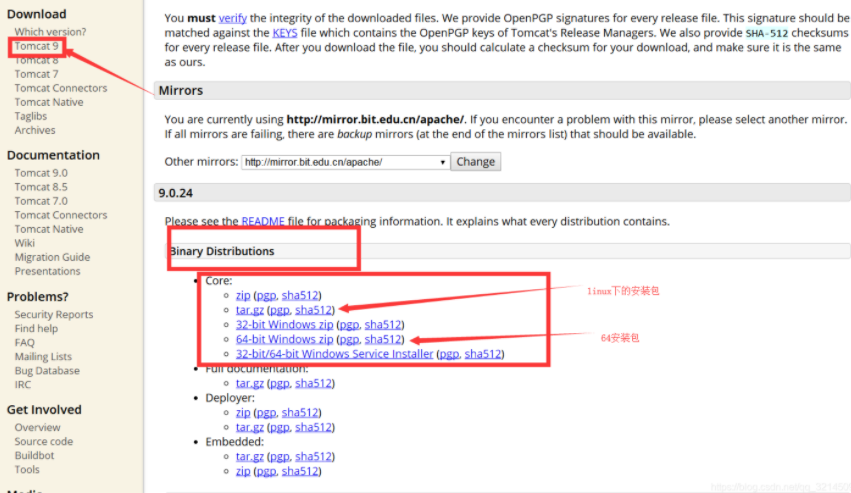
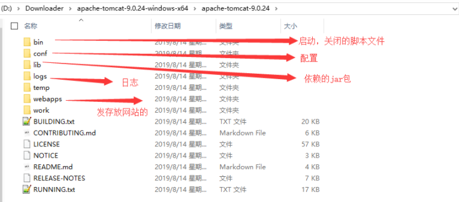
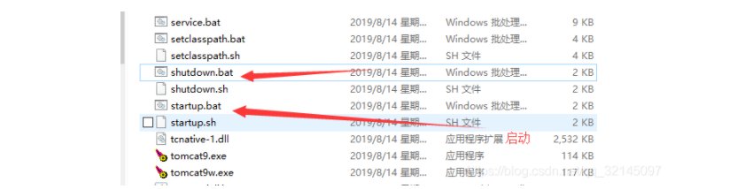
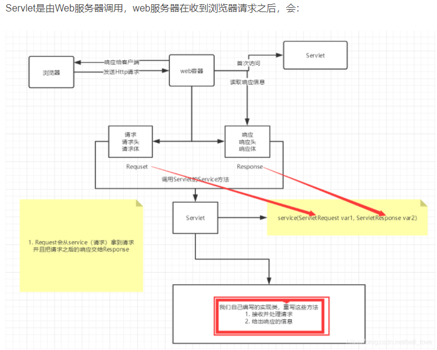

# javaWeb


## 一.基本概念

### 1.web开发

- 静态web开发
  html，css 提供给所有人看的数据始终不会发生变化！
- 动态web开发
  几乎是所有的网站； 提供给所有人看的数据始终会发生变化，每个人在不同的时间，不同的地点看到的信息各不相同！
- 技术栈：Servlet/JSP，ASP，PHP

**在Java中，动态web资源开发的技术统称为JavaWeb；**

### 2.web应用程序

#### 1.web应用程序：可以提供浏览器访问的程序

##### 1.根据web展示情况分为   静态web和动态web

- 静态web

  - *.htm, *.html,这些都是网页的后缀，如果服务器上一直存在这些东西，我们就可以直接进行读取。

  - 

  - 静态web存在的缺点：Web页面无法动态更新，所有用户看到都是同一个页面。
    1.轮播图，点击特效：伪动态
    2.JavaScript[实际开发中，它用的最多]

    3.它无法和数据库交互，数据无法持久化，用户无法交互

- 动态web

  - 页面会动态展示： “Web的页面展示的效果因人而异”；

  - 

  - 缺点：

    - 加入服务器的动态web资源出现了错误，我们需要重新编写我们的后台程序,重新发布； 停机维护。

    优点：

    - Web页面可以动态更新，所有用户看到都不是同一个页面
    - 它可以与数据库交互 （数据持久化：注册，商品信息，用户信息…）

  - 如果存在同数据库交互的情况

#### 2.URL:统一资源定位符

## 二.web服务器

### 1.编写语言或技术栈分类

- asp
  - 微软：国内最早流行的就是ASP；
  - 在HTML中嵌入了VB的脚本， ASP + COM；
  - 在ASP开发中，基本一个页面都有几千行的业务代码，页面极其换乱
  - 维护成本高
  - C#编写
  - IIS：在控制面板中启动windows服务
- php
  - PHP开发速度很快，功能很强大，跨平台，代码很简单 （70% , WP）
  - 无法承载大访问量的情况（局限性）
- jsp
  - B/S：浏览和服务器
  - C/S: 客户端和服务器
    - sun公司主推的B/S架构
    - 基于Java语言的 (所有的大公司，或者一些开源的组件，都是用Java写的)
    - 可以承载三高（高并发，高可用，高性能）问题带来的影响

### 2.Web服务器

```xml
服务器是一种被动的操作，用来处理用户的一些请求和给用户一些响应信息；
```

#### 1.IIS

#### 2.tomcat


```xml
Tomcat是Apache 软件基金会（Apache Software Foundation）的Jakarta 项目中的一个核心项目，最新的Servlet 和JSP 规范总是能在Tomcat 中得到体现，因为Tomcat 技术先进、性能稳定，而且免费，因而深受Java 爱好者的喜爱并得到了部分软件开发商的认可，成为目前比较流行的Web 应用服务器。

Tomcat 服务器是一个免费的开放源代码的Web 应用服务器，属于轻量级应用服务器，在中小型系统和并发访问用户不是很多的场合下被普遍使用，是开发和调试JSP 程序的首选。对于一个Java初学web的人来说，它是最佳的选择
```

##### 1.安装Tomcat

- tomcat官网：http://tomcat.apache.org/



**下载解压到相应文件夹下**

注：通常开发环境如果非必要装在C盘默认路径下的，其余均放在同一路径下



启动/测试/关闭Tomcat



测试地址：http://localhost:8080/

##### 2.可能遇到的问题

- Java环境变量没有配置
- 闪退问题：需要配置兼容性
- 乱码问题：配置文件中设置

## 三.Http

### 1.什么是Http？

```xml
HTTP（超文本传输协议）是一个简单的请求-响应协议，它通常运行在TCP之上。

超文本和普通文本：
文本：html，字符串，~ ….
超文本：图片，音乐，视频，定位，地图…….
80
```

### 2.http的两个时代

#### 1.http1.0

http1.0：客户端可以与web服务器连接后，只能获得一个web资源，断开连接。

#### 2.http2.0

HTTP/1.1：客户端可以与web服务器连接后，可以获得多个web资源。

### 3.http请求

**客户端--请求（Request）--服务器**

**请求行：**

```java
Request URL:https://www.baidu.com/   请求地址
Request Method:GET    get方法/post方法
Status Code:200 OK    状态码：200
Remote（远程） Address:14.215.177.39:443
    
Accept:text/html  
Accept-Encoding:gzip, deflate, br
Accept-Language:zh-CN,zh;q=0.9    语言
Cache-Control:max-age=0
Connection:keep-alive
```

#### 1.请求方式

```xml
请求行中的请求方式：GET

请求方式：Get，Post，HEAD,DELETE,PUT,TRACT…

 get：请求能够携带的参数比较少，大小有限制，会在浏览器的URL地址栏显示数据内容，不安全，但高效

 post：请求能够携带的参数没有限制，大小没有限制，不会在浏览器的URL地址栏显示数据内容，安全，但不高效。
```

### 4.http响应

**服务器--响应（response）--客户端**

#### 1.响应体

```xml
Accept：告诉浏览器，它所支持的数据类型
Accept-Encoding：支持哪种编码格式  GBK   UTF-8   GB2312  ISO8859-1
Accept-Language：告诉浏览器，它的语言环境
Cache-Control：缓存控制
Connection：告诉浏览器，请求完成是断开还是保持连接
HOST：主机..../.
Refresh：告诉客户端，多久刷新一次；
Location：让网页重新定位；
```

#### 2.响应状态码

200：请求响应成功

3xx：请求重定向

- 重定向：你重新到我给你新位置去；

4xx：找不到资源 404

- 资源不存在；

5xx：服务器代码错误 

- 500 502:网关错误

## 四.servlet

### 1.servlet简介

Servlet就是sun公司开发动态web的一门技术

### 2.第一个servlet程序

> Serlvet接口Sun公司有两个默认的实现类：httpServlet，GenericServlet

### 3.servlet运行原理




五.

六.

七.

八.

九.


