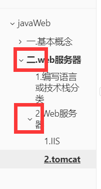
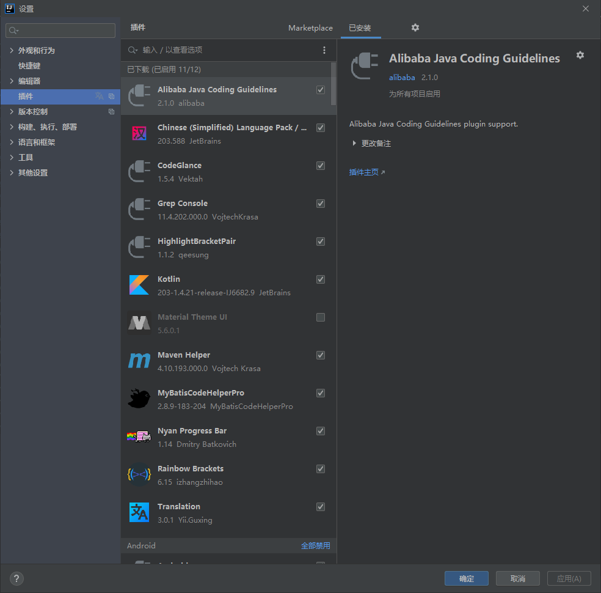
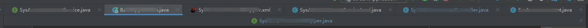
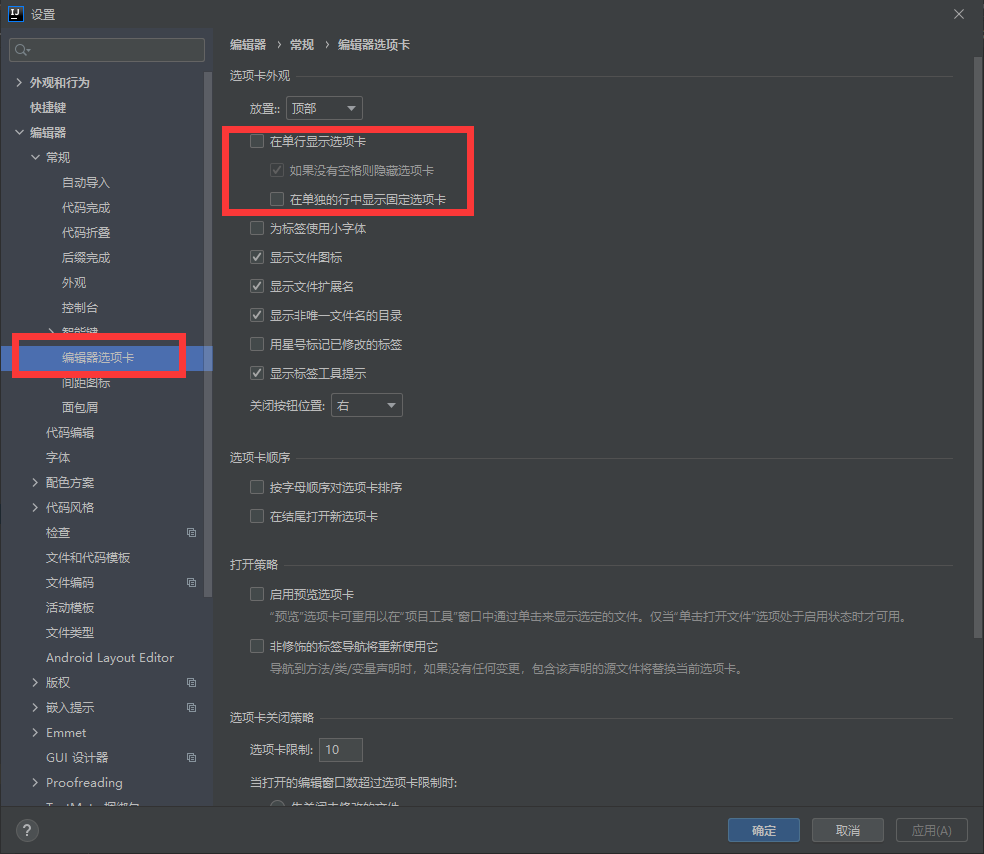
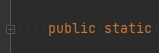

新机器：更新ing

2021年2月18日15:18:04更新

注：文章链接为引用他人链接，详情暂不赘述，感恩同行发光发热。

## 一.下载（packge）

1. java JDK
2. 谷歌浏览器
3. maven
4. tomcat
5. vscode
6. Jetbrains tool box（IDEA/···）
7. mysql 5.7/···
8. git
9. sourceTree
10. typora
11. notepad++
12. redis
13. postman
14. 360极速浏览器
15. everything
16. Edge浏览器
17. ···

## 二. 安装及环境配置（系统环境变量配置）

**注：建议java/mysql/git等默认安装，工具类软件自定义安装**

### 1.java

安装及环境变量配置https://blog.csdn.net/kangmiao89757/article/details/9993887?ops_request_misc=%25257B%252522request%25255Fid%252522%25253A%252522160851668416780277053420%252522%25252C%252522scm%252522%25253A%25252220140713.130102334..%252522%25257D&request_id=160851668416780277053420&biz_id=0&utm_medium=distribute.pc_search_result.none-task-blog-2~all~sobaiduend~default-1-9993887.nonecase&utm_term=java%E5%AE%89%E8%A3%85%E5%8F%8A%E9%85%8D%E7%BD%AE%E6%95%99%E7%A8%8B

### 2.maven

安装及环境变量控制（更改仓库为阿里云公共仓库）https://caochenlei.blog.csdn.net/article/details/111183810?ops_request_misc=&request_id=&biz_id=102&utm_term=maven&utm_medium=distribute.pc_search_result.none-task-blog-2~all~sobaiduweb~default-3-111183810.nonecase

### 3.MySql

安装及环境变量控制https://blog.csdn.net/Mxdon_on/article/details/89461513?ops_request_misc=%25257B%252522request%25255Fid%252522%25253A%252522160851066016780276386828%252522%25252C%252522scm%252522%25253A%25252220140713.130102334..%252522%25257D&request_id=160851066016780276386828&biz_id=0&utm_medium=distribute.pc_search_result.none-task-blog-2~all~top_click~default-1-89461513.nonecase&utm_term=mysql%E5%AE%89%E8%A3%85%E9%85%8D%E7%BD%AE%E6%95%99%E7%A8%8B

### 4.typora

- 常用快捷键学习https://blog.csdn.net/knight_zhou/article/details/106223251?ops_request_misc=%25257B%252522request%25255Fid%252522%25253A%252522160851693116780308358190%252522%25252C%252522scm%252522%25253A%25252220140713.130102334..%252522%25257D&request_id=160851693116780308358190&biz_id=0&utm_medium=distribute.pc_search_result.none-task-blog-2~all~top_click~default-1-106223251.nonecase&utm_term=typora%E5%BF%AB%E6%8D%B7%E9%94%AE

- 大纲折叠展示

  设置：https://blog.csdn.net/tian_ci/article/details/85257667

  

### 5.Git

### 6. jetbrains toolbox

- 工具安装目录：默认安装及缓存在C盘
- 代码放大缩小：https://www.cnblogs.com/zlslch/p/7770965.html
- IDEA插件：mybatiscoderhelper（安装及激活）：https://blog.csdn.net/lianghecai52171314/article/details/105511508
- IDEA其他花里胡哨的插件：

- IDEA选项卡双排显示：

效果图：

如何设置？：

- IDEA设置使空格处显示小点：https://www.cnblogs.com/lu51211314/p/10119163.html

效果图：

### N.其他

- CMD命令：java/maven/ping/mysql/

