# SpringFamily


## SpringCloud

注：

- 官方网站：https://spring.io/projects/spring-cloud
- 中文学习网站：https://www.springcloud.cc/
- 快速开始：https://www.springcloud.cc/spring-cloud-config.html#_quick_start
- 截止2021.01.11，SpringCloud更新到2020.0.0

### 一.什么是SpringCloud

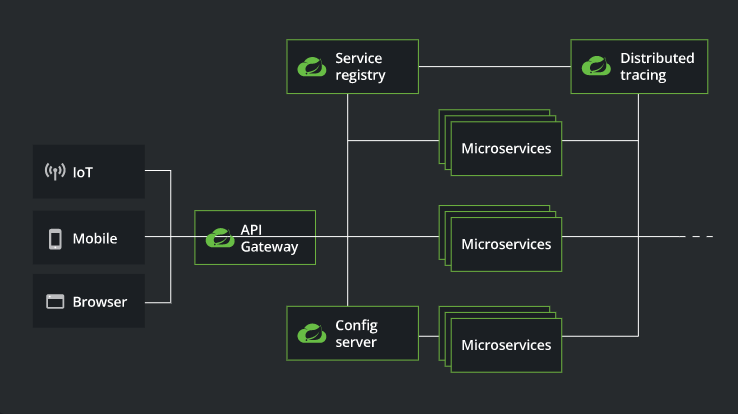

```xml
	Spring Cloud为开发人员提供了快速构建分布式系统中的一些常见模式的工具(例如配置管理、服务注册与发现、断路器、智能路由、微代理、控制总线、一次性令牌、全局锁、领导人选举、分布式会话、集群状态)。分布式系统的协调导致了锅炉板模式，而使用Spring Cloud开发人员可以快速建立实现这些模式的服务和应用程序。它们在任何分布式环境中都能很好地工作，包括开发人员自己的笔记本电脑、裸金属数据中心和云计算等托管平台。
```


### 二.为什么用SpringCloud

#### 1.SpringCloud和SpringBoot的关系

```xml
1. SpringBoot专注于开发方便的开发单个个体微服务；SpringCloud是关注全局的微服务协调整理治理框架，它将SpringBoot开发的一个个单体微服务，整合并管理起来，为各个微服务之间提供：配置管理、服务发现、断路器、路由、为代理、事件总栈、全局锁、决策竞选、分布式会话等等集成服务；
2. SpringBoot可以离开SpringCloud独立使用，开发项目，但SpringCloud离不开SpringBoot，属于依赖关系
```

2.什么是微服务？

```xml
微服务是指具体解决某一个问题/提供落地对应服务的一个服务应用，狭义的看，可以看作是IDEA中的一个个微服务工程，或者Moudel。
```

3.微服务与微服务架构

```xml
通常而言，微服务架构是一种架构模式，或者说是一种架构风格，它体长将单一的应用程序划分成一组小的服务，每个服务运行在其独立的自己的进程内，服务之间互相协调，互相配置，为用户提供最终价值，服务之间采用轻量级的通信机制(HTTP)互相沟通，每个服务都围绕着具体的业务进行构建，并且能狗被独立的部署到生产环境中，另外，应尽量避免统一的，集中式的服务管理机制，对具体的一个服务而言，应该根据业务上下文，选择合适的语言，工具(Maven)对其进行构建，可以有一个非常轻量级的集中式管理来协调这些服务，可以使用不同的语言来编写服务，也可以使用不同的数据存储。
```

4.微服务的优缺点

```xml
优点：
1.	单一职责原则；
2.	每个服务足够内聚，足够小，代码容易理解，这样能聚焦一个指定的业务功能或业务需求；
3.	开发简单，开发效率高，一个服务可能就是专一的只干一件事；
4.	微服务能够被小团队单独开发，这个团队只需2-5个开发人员组成；
5.	微服务是松耦合的，是有功能意义的服务，无论是在开发阶段或部署阶段都是独立的；
6.	微服务能使用不同的语言开发；
7.	易于和第三方集成，微服务允许容易且灵活的方式集成自动部署，通过持续集成工具，如jenkins，Hudson，bamboo；
8.	微服务易于被一个开发人员理解，修改和维护，这样小团队能够更关注自己的工作成果，无需通过合作才能体现价值；
9.	微服务允许利用和融合最新技术；
10.	微服务只是业务逻辑的代码，不会和HTML，CSS，或其他的界面混合;
11.	每个微服务都有自己的存储能力，可以有自己的数据库，也可以有统一的数据库；

缺点：
1.	开发人员要处理分布式系统的复杂性；
2.	多服务运维难度，随着服务的增加，运维的压力也在增大；
3.	系统部署依赖问题；
4.	服务间通信成本问题；
5.	数据一致性问题；
6.	系统集成测试问题；
7.	性能和监控问题；
```

5.微服务技术栈

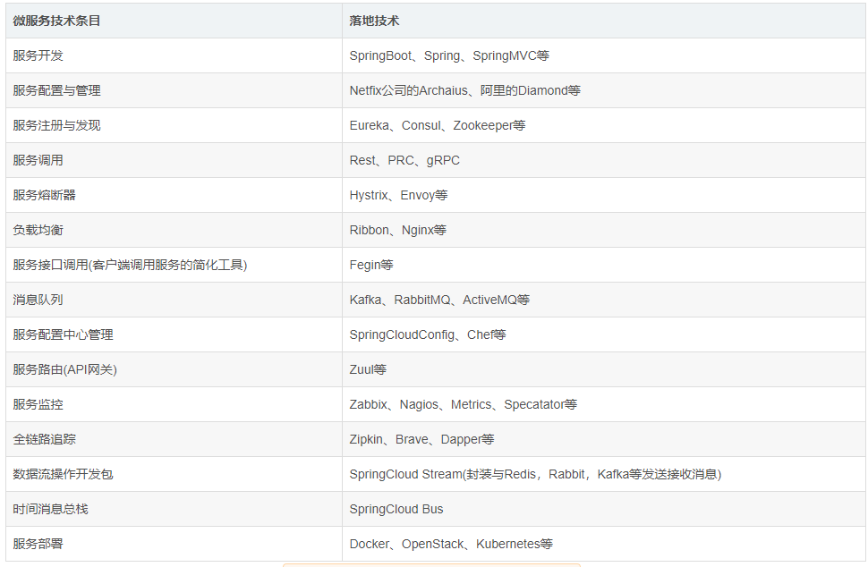

6.dubbo和SpringCloud

### 三.SpringCloud

#### 1.SpringCloud版本选择

- 采用伦敦地铁站进行版本区分，推荐使用GA稳定版本（截止2021.01.12，版本更新到2020.0.0）

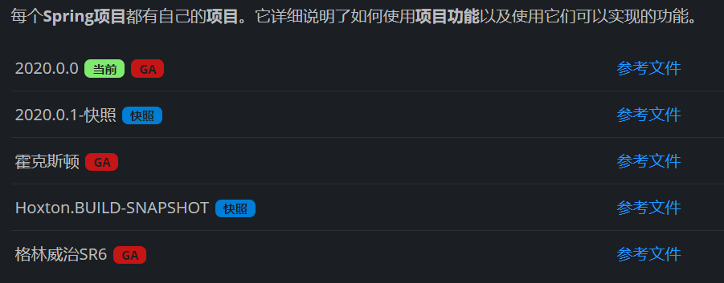

#### 2.SpringCloud快速开始

- 快速开始：https://www.springcloud.cc/spring-cloud-config.html#_quick_start

#### 3.配置类文件参考

##### 1.maven依赖导入

```xml
<!---->
<dependency>
    <groupId></groupId>
    <artifactId></artifactId>
    <version></version>
</dependency>
```

```xml
    <properties>
        <maven.compiler.source>8</maven.compiler.source>
        <maven.compiler.target>8</maven.compiler.target>
        <lomok.version>1.18.16</lomok.version>
    </properties>

	<!--注：版本截止到2021.01.12-->
    <!--打包方式-->
    <packaging>pom</packaging>

    <dependencyManagement>
        <dependencies>

            <!--SpringCloud依赖-->
            <dependency>
                <groupId>org.springframework.cloud</groupId>
                <artifactId>spring-cloud-dependencies</artifactId>
                <version>Hoxton.SR1</version>
                <type>pom</type>
            </dependency>

            <!--SpringBoot-->
            <dependency>
                <groupId>org.springframework.boot</groupId>
                <artifactId>spring-boot-dependencies</artifactId>
                <version>2.4.1</version>
            </dependency>

            <!--SpringBoot启动器-->
            <dependency>
                <groupId>org.springframework.boot</groupId>
                <artifactId>spring-boot-starter</artifactId>
                <version>2.4.1</version>
            </dependency>

            <!--数据库-->
            <dependency>
                <groupId>mysql</groupId>
                <artifactId>mysql-connector-java</artifactId>
                <version>5.1.38</version>
            </dependency>

            <!--数据源-->
            <dependency>
                <groupId>com.alibaba</groupId>
                <artifactId>druid</artifactId>
                <version>1.1.23</version>
            </dependency>

            <!--myBatis-->
            <dependency>
                <groupId>org.mybatis.spring.boot</groupId>
                <artifactId>mybatis-spring-boot-starter</artifactId>
                <version>2.1.4</version>
            </dependency>

            <!--log4j-->
            <dependency>
                <groupId>log4j</groupId>
                <artifactId>log4j</artifactId>
                <version>1.2.17</version>
            </dependency>

            <!--junit-->
            <dependency>
                <groupId>junit</groupId>
                <artifactId>junit</artifactId>
                <version>4.13.1</version>
                <scope>test</scope>
            </dependency>

            <!--lombok-->
            <dependency>
                <groupId>org.projectlombok</groupId>
                <artifactId>lombok</artifactId>
                <version>${lomok.version}</version>
            </dependency>

        </dependencies>
```

- 方便依赖导入版本维护，将version提到properties维护

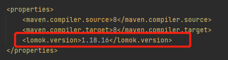

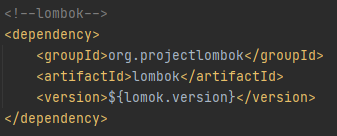


- 新建其他模块时导入需要的模块

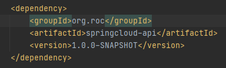

##### 2.mybatis-config.xml文件头

```xml
<?xml version="1.0" encoding="UTF-8" ?>
<!DOCTYPE configuration
        PUBLIC "-//mybatis.org//DTD Config 3.0//EN"
        "http://mybatis.org/dtd/mybatis-3-config.dtd">
<configuration>

</configuration>
```

##### 3.mapper.xml文件头

```xml
<?xml version="1.0" encoding="UTF-8" ?>
<!DOCTYPE mapper
        PUBLIC "-//mybatis.org//DTD Config 3.0//EN"
        "http://mybatis.org/dtd/mybatis-3-mapper.dtd">
<mapper namespace= "dao文件路径">
//CRUD
</mapper>
```

##### 4.新建项目启动类

```java
//启动类:请自定义启动类名称
@SpringBootApplication
public class DeptProvider_8001 {
    public static void main(String[] args) {
        SpringApplication.run(DeptProvider_8001.class,args);
    }
}
```

##### 5.application.yml文件

```xml
#服务端口号
server:
  port: 8001

#MyBatis配置
mybatis:
  type-aliases-package: com.roc.springcloud.pojo.api
  config-location: classpath:mybatis-config.xml
  mapper-locations: classpath:mappers/*.xml

#Spring配置
spring:
  application:
    name: springcloud-provider

#数据源及数据库配置
  datasource:
    type: com.alibaba.druid.pool.DruidDataSource
    driver-class-name: com.alibaba.druid.proxy.DruidDriver
    url: jdbc:mysql://localhost:3306/Db01?useUnicode=true&characterEncoding=utf-8
    username: root
    password: 123456
```

#### 4.新建SpringCloud项目遇见的问题

- 纯Maven项目：新建项目时目录一直延长：编写package时重写全部项目文件路径，IDEA识别后会拆开

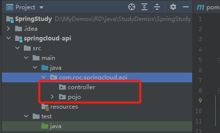

- 链式写法：注解@Accessors(chain = true)


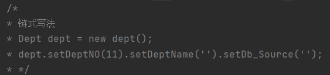

#### 5.Eureka:服务注册与发现

##### 1).什么是Eureka？

```xml
Eureka是Netflix的有个子模块，也是核心模块之一。Eureka是基于REST的服务，用于定位服务，以实现云端中间件层服务发现和故障转移，服务注册与发现对于微服务来说是非常重要的，有了服务注册与发现，只需要使用服务的标识符，就可以访问到服务，而不需要修改服务调用的配置文件了，功能类似于Dubbo的注册中心，比如Zookeeper.
```

##### 2).Eureka:基本架构

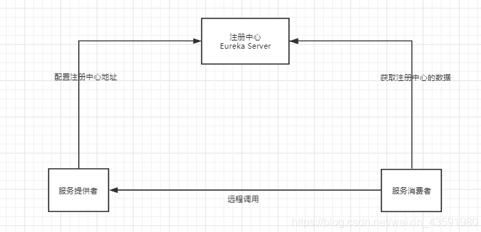

```xml
系统中的其他微服务，使用Eureka的客户端连接到EurekaServer并维持心跳连接。这样系统的维护人员就可以通过EurekaServer来监控系统中各个微服务是否正常运行，Springcloud 的一些其他模块 (比如Zuul) 就可以通过EurekaServer来发现系统中的其他微服务，并执行相关的逻辑.
```

##### 3).构建配置Eureka.server

###### (1).pom.xml配置

```xml
<!--导入Eureka Server依赖-->
<dependency>
    <groupId>org.springframework.cloud</groupId>
    <artifactId>spring-cloud-starter-eureka-server</artifactId>
    <version>1.4.6.RELEASE</version>
</dependency>
```

###### (2).application.yaml配置

```xml
server:
  port: 7001

# Eureka配置
eureka:
  instance:
    # Eureka服务端的实例名字
    hostname: 127.0.0.1
  client:
    # 表示是否向 Eureka 注册中心注册自己(这个模块本身是服务器,所以不需要)
    register-with-eureka: false
    # fetch-registry如果为false,则表示自己为注册中心,客户端的化为 ture
    fetch-registry: false
    # Eureka监控页面~
    service-url:
      defaultZone: http://${eureka.instance.hostname}:${server.port}/eureka/
```

##### 4).构建配置Eureka.client

###### (1).pom.xml配置

```xml
<!--Eureka依赖-->
<!-- https://mvnrepository.com/artifact/org.springframework.cloud/spring-cloud-starter-eureka -->
<dependency>
    <groupId>org.springframework.cloud</groupId>
    <artifactId>spring-cloud-starter-eureka</artifactId>
    <version>1.4.6.RELEASE</version>
</dependency>

```

###### (2).application.yaml

```xml
# Eureka配置：配置服务注册中心地址
eureka:
  client:
    service-url:
      defaultZone: http://localhost:7001/eureka/
```

###### (3).给主启动类添加@EnableEurekaClient注解

```xml
/**
 * @Auther: wp
 * @Date: 2021年1月15日11:39:51
 * @Description: 启动类
 */
@SpringBootApplication
// @EnableEurekaClient 开启Eureka客户端注解，在服务启动后自动向注册中心注册服务
@EnableEurekaClient
public class DeptProvider_8001 {
    public static void main(String[] args) {
        SpringApplication.run(DeptProvider_8001.class,args);
    }
}
```

-----------------------------------------------**服务注册成功**-----------------------------------------------

##### （4).修改Eureka上的默认描述信息

```xml
# Eureka配置：配置服务注册中心地址
eureka:
  client:
    service-url:
      defaultZone: http://localhost:7001/eureka/
  instance:
    instance-id: springcloud-provider-dept-8001 #修改Eureka上的默认描述信息
```

**截止以上其他个性化操作，包括单个服务的注册已经全部实现。**

###### (5).关于Eureka的保护机制

**注：Eureka心跳健康检查机制：https://www.jdon.com/springcloud/eureka-health-monitoring.html**

```xml
1.根据上图可得到，Eureka.server本身作为SpringCloud项目中的一个微服务存在，其他的微服务通过导入Eureka.client的jar成为一个Eureka的客户端，客户端会通过请求想server发送请求，也就是所谓的心跳，server来判断这个客户端是否还在继续工作。

2.触发保护机制：
  当因为网络原因，微服务和server之间无法进行通信，但是服务依旧是健康的，此时server不应该注销该服务，于是，进入自我保护模式。一旦进入保护模式，server则保护服务注册表中的信息，不在删除服务注册表中的数据，也不会注销任何微服务。同样当网络恢复后，server自动退出保护机制。综上所述，自我保护模式是一种应对网络异常的安全保护措施。

3.架构哲学：它的架构哲学是宁可同时保留所有微服务（健康的微服务和不健康的微服务都会保留），也不盲目注销任何健康的微服务。使用自我保护模式，可以让Eureka集群更加的健壮、稳定。

4.在Spring Cloud中，可以使用eureka.server.enable-self-preservation = false 禁用自我保护模式。
```

##### 5).Eureka：集群环境配置

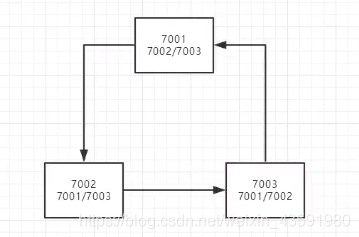

```xml
搭建Eureka集群，确保单个server挂掉之后其他服务仍然可以使用。一个服务需要绑定多个Eureka，即使一个挂掉，其他仍旧可以使用。主要为理解集群的概念，同样的服务来承担出错的风险。
```

##### 6).对比Eureka和Zookeeper的区别

注：**CAP**

```xml
1.什么是CAP原则？
CAP定理又称CAP原则，指的是在一个分布式系统中，Consistency（一致性）、 Availability（可用性）、Partition tolerance（分区容错性），最多只能同时三个特性中的两个，三者不可兼得。

CAP：是指的一致性，可用性，分区容错性

C：一致性:即更新操作成功并返回客户端后，所有节点在同一时间的数据完全一致，这就是分布式的一致性。

A:可用性：即服务一直可用，而且是正常响应时间。

P:分区容错性：即分布式系统在遇到某节点或网络分区故障的时候，仍然能够对外提供满足一致性或可用性的服务。
```

注：CA，CP，AP

```xml
CA without P：如果不要求P（不允许分区），则C（强一致性）和A（可用性）是可以保证的。但放弃P的同时也就意味着放弃了系统的扩展性，也就是分布式节点受限，没办法部署子节点，这是违背分布式系统设计的初衷的。

CP without A：如果不要求A（可用），相当于每个请求都需要在服务器之间保持强一致，而P（分区）会导致同步时间无限延长(也就是等待数据同步完才能正常访问服务)，一旦发生网络故障或者消息丢失等情况，就要牺牲用户的体验，等待所有数据全部一致了之后再让用户访问系统。设计成CP的系统其实不少，最典型的就是分布式数据库，如Redis、HBase等。对于这些分布式数据库来说，数据的一致性是最基本的要求，因为如果连这个标准都达不到，那么直接采用关系型数据库就好，没必要再浪费资源来部署分布式数据库。

 AP wihtout C：要高可用并允许分区，则需放弃一致性。一旦分区发生，节点之间可能会失去联系，为了高可用，每个节点只能用本地数据提供服务，而这样会导致全局数据的不一致性。典型的应用就如某米的抢购手机场景，可能前几秒你浏览商品的时候页面提示是有库存的，当你选择完商品准备下单的时候，系统提示你下单失败，商品已售完。这其实就是先在 A（可用性）方面保证系统可以正常的服务，然后在数据的一致性方面做了些牺牲，虽然多少会影响一些用户体验，但也不至于造成用户购物流程的严重阻塞。
```

根据实际业务去考虑取舍问题

1.银行业务：务必保证数据一致性，在可用性和分区容错进行取舍。

2..........

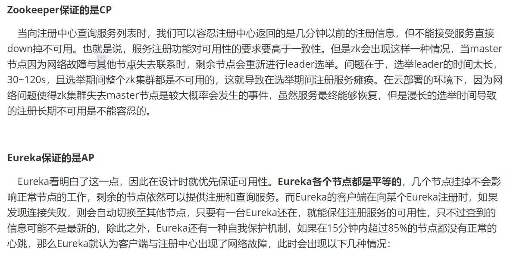

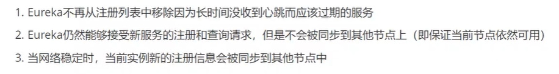

#### 6.Ribbon:客户端负载均衡工具

##### 1.Ribbon是什么？

```xml
Ribbon 是 Netflix 发布的开源项目，主要功能是提供客户端的软件负载均衡算法，将 Netflix 的中间层服务连接在一起。Ribbon 的客户端组件提供一系列完整的配置项，如：连接超时、重试等。简单的说，就是在配置文件中列出 LoadBalancer (简称LB：负载均衡) 后面所有的及其，Ribbon 会自动的帮助你基于某种规则 (如简单轮询，随机连接等等) 去连接这些机器。我们也容易使用 Ribbon 实现自定义的负载均衡算法！
```

##### 2.Ribbon能做什么？

```xml
1.将用户的请求平摊的分配到多个服务上，从而达到系统的HA (高用)
```

**注：**

1. 常见的负载均衡软件有Nginx，Lvs等
2. Dubbo、SpringCloud 中均给我们提供了负载均衡，**SpringCloud 的负载均衡算法可以自定义**
3. 负载均衡分类：

- 集中式LB
  - 即在服务的提供方和消费方之间使用独立的LB设施，如**Nginx(反向代理服务器)**，由该设施负责把访问请求通过某种策略转发至服务的提供方！
- 进程式LB
  - 将LB逻辑集成到消费方，消费方从服务注册中心获知有哪些地址可用，然后自己再从这些地址中选出一个合适的服务器。
  - **Ribbon 就属于进程内LB**，它只是一个类库，集成于消费方进程，消费方通过它来获取到服务提供方的地址！

##### 3.集成Ribbon

###### 1.pom.xml：集成Ribbon和Eureka

```xml
<!--Ribbon-->
<dependency>
    <groupId>org.springframework.cloud</groupId>
    <artifactId>spring-cloud-starter-ribbon</artifactId>
    <version>1.4.6.RELEASE</version>
</dependency>
<!--Eureka: Ribbon需要从Eureka服务中心获取要拿什么-->
<dependency>
    <groupId>org.springframework.cloud</groupId>
    <artifactId>spring-cloud-starter-eureka</artifactId>
    <version>1.4.6.RELEASE</version>
</dependency>
```

###### 2.application.yaml

 配置Eureka

```xml
# Eureka配置
eureka:
  client:
    register-with-eureka: false # 不向 Eureka注册自己
    service-url: # 从三个注册中心中随机取一个去访问
      defaultZone: http://eureka7001.com:7001/eureka/,http://eureka7002.com:7002/eureka/,http://eureka7003.com:7003/eureka/
```

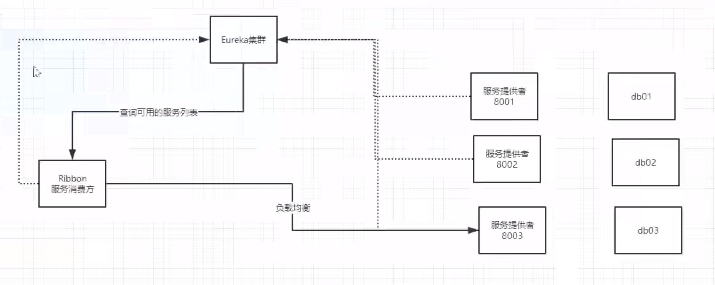

#### 7.Feign负载均衡

#####  1.什么是Feign？

Feign是声明式Web Service客户端，它让微服务之间的调用变得更简单，**类似controller调用service。**

##### 2.Feign能做什么？

Feign在Ribbon的基础上集成并封装了对Http的请求，**在Feign的实现下，我们只需要创建一个接口并使用注解的方式来配置它 (类似以前Dao接口上标注Mapper注解，现在是一个微服务接口上面标注一个Feign注解)，即可完成对服务提供方的接口绑定，简化了使用Spring Cloud Ribbon 时，自动封装服务调用客户端的开发量。**

##### 3.Feign与Ribbon

两者皆可实现负载均衡，Ribbon是Feign的子集，对于性能来讲，由于Feign进行了二次操作，所以存在性能会比Ribbon略低的可能。

与**Ribbon**不同的是，通过**Feign**只需要定义服务绑定接口且以声明式的方法，优雅而简单的实现了服务调用。

##### 4.集成Feign

提供服务方+负载均衡客户端都需导入Feign，消费方则只管消费即可。

```xml
<!--Feign的依赖-->
<dependency>
    <groupId>org.springframework.cloud</groupId>
    <artifactId>spring-cloud-starter-feign</artifactId>
    <version>1.4.6.RELEASE</version>
</dependency>
```

##### 5.Feign和Ribbon如何选择？

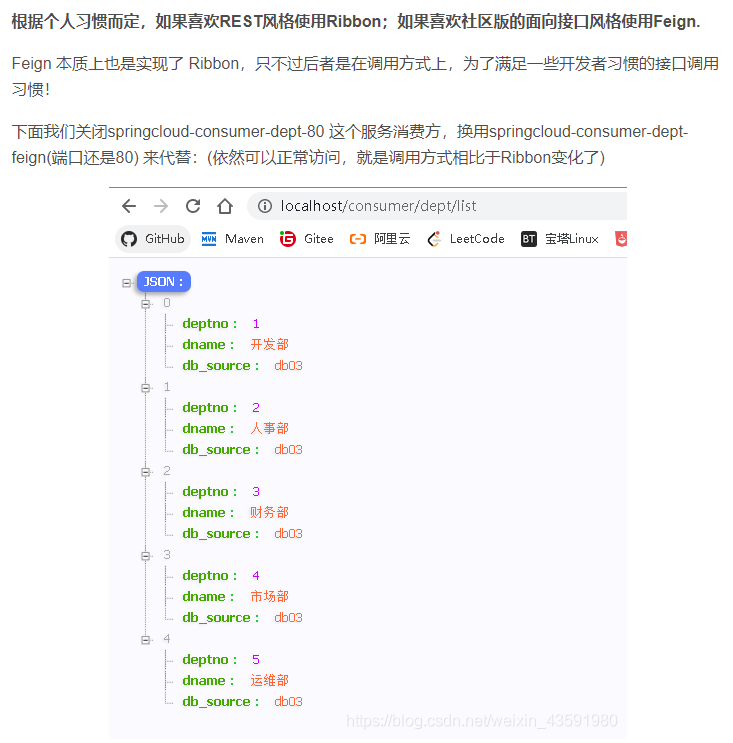

#### 8.HyStrix：服务熔断

> 复杂分布式体系结构中的应用程序有数十个依赖关系，每个依赖关系在某些时候将不可避免失败！

##### 分布式系统中服务雪崩是什么？

```xml
多个微服务之间调用的时候，假设微服务A调用微服务B和微服务C，微服务B和微服务C又调用其他的微服务，这就是所谓的“扇出”，如果扇出的链路上某个微服务的调用响应时间过长，或者不可用，对微服务A的调用就会占用越来越多的系统资源，进而引起系统崩溃，所谓的“雪崩效应”。
```

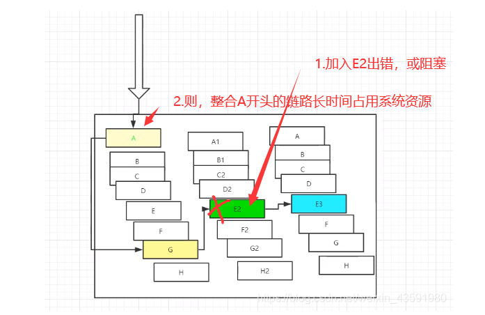

##### 1.什么是HyStrix？

 **Hystrix**是一个应用于处理分布式系统的延迟和容错的开源库，在分布式系统里，许多依赖不可避免的会调用失败，比如超时，异常等，**Hystrix** 能够保证在一个依赖出问题的情况下，不会导致整个体系服务失败，避免级联故障，以提高分布式系统的弹性。

 “**断路器**”本身是一种开关装置，当某个服务单元发生故障之后，通过断路器的故障监控 (类似熔断保险丝) ，**向调用方返回一个服务预期的，可处理的备选响应 (FallBack) ，而不是长时间的等待或者抛出调用方法无法处理的异常，这样就可以保证了服务调用方的线程不会被长时间，不必要的占用**，从而避免了故障在分布式系统中的蔓延，乃至雪崩。

##### 2.HyStrix能做什么？

- 服务降级
- 服务熔断
- 服务限流
- 接近实时的监控

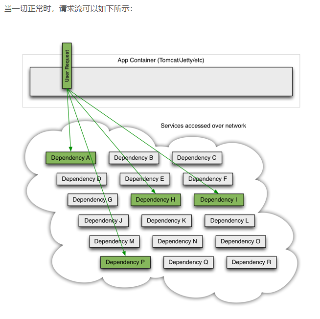

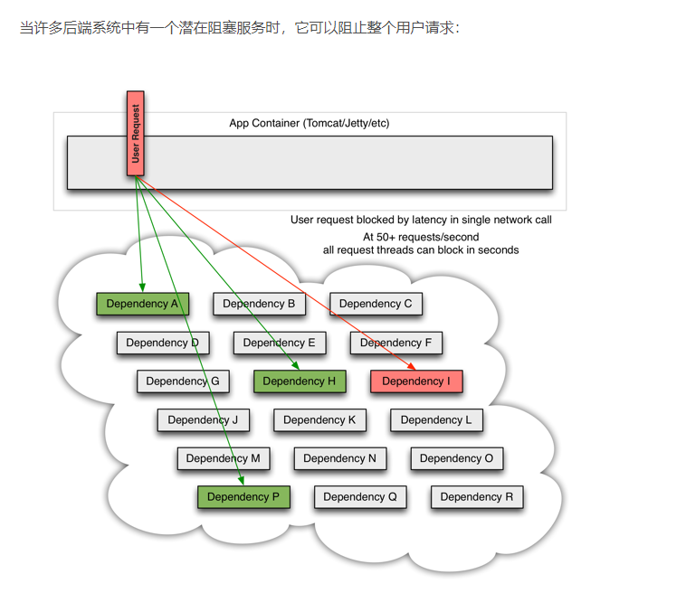

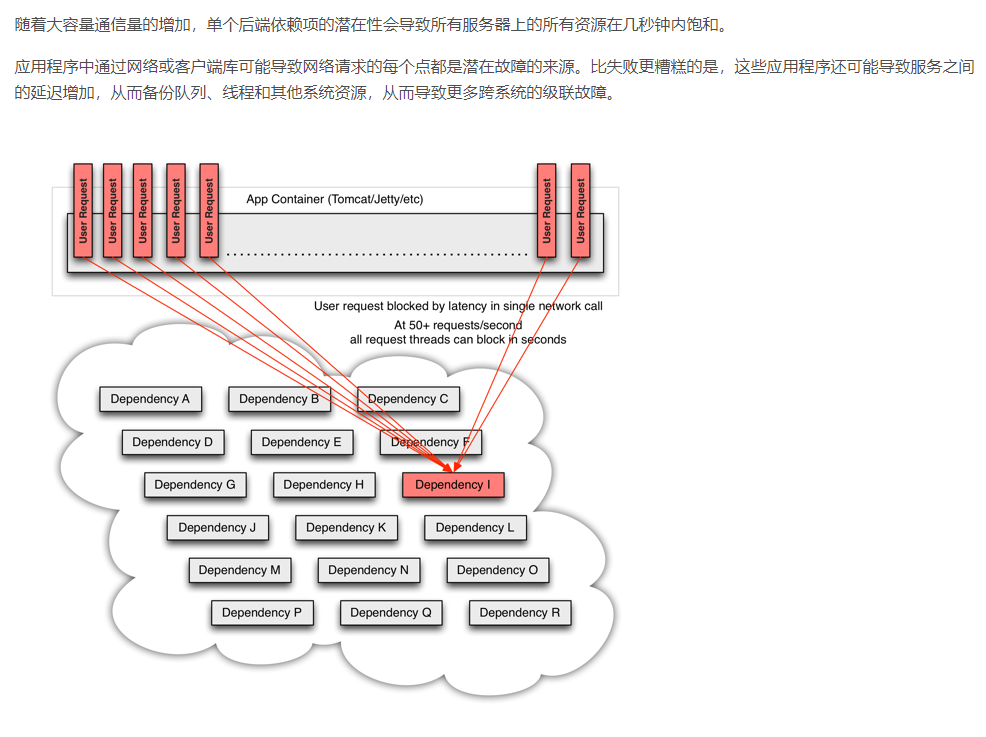

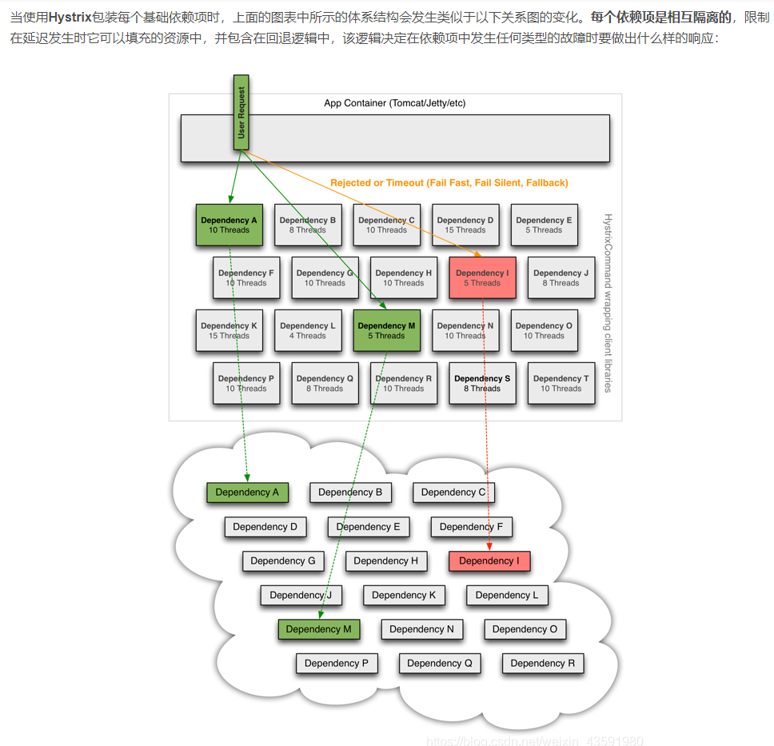

##### 3.什么是HyStrix服务熔断？

```xml
 熔断机制是赌赢雪崩效应的一种微服务链路保护机制。

​ 当扇出链路的某个微服务不可用或者响应时间太长时，会进行服务的降级，进而熔断该节点微服务的调用，快速返回错误的响应信息。检测到该节点微服务调用响应正常后恢复调用链路。在SpringCloud框架里熔断机制通过Hystrix实现。Hystrix会监控微服务间调用的状况，当失败的调用到一定阀值缺省是5秒内20次调用失败，就会启动熔断机制。熔断机制的注解是：@HystrixCommand。
```

##### 4.实现HyStrix服务熔断

 ```xml
<!--导入Hystrix依赖-->
<dependency>
    <groupId>org.springframework.cloud</groupId>
    <artifactId>spring-cloud-starter-hystrix</artifactId>
    <version>1.4.6.RELEASE</version>
</dependency>
 ```

##### 5.服务降级

```xml
服务降级是指 当服务器压力剧增的情况下，根据实际业务情况及流量，对一些服务和页面有策略的不处理，或换种简单的方式处理，从而释放服务器资源以保证核心业务正常运作或高效运作。说白了，就是尽可能的把系统资源让给优先级高的服务。

资源有限，而请求是无限的。如果在并发高峰期，不做服务降级处理，一方面肯定会影响整体服务的性能，严重的话可能会导致宕机某些重要的服务不可用。所以，一般在高峰期，为了保证核心功能服务的可用性，都要对某些服务降级处理。比如当双11活动时，把交易无关的服务统统降级，如查看蚂蚁深林，查看历史订单等等。

服务降级主要用于什么场景呢？当整个微服务架构整体的负载超出了预设的上限阈值或即将到来的流量预计将会超过预设的阈值时，为了保证重要或基本的服务能正常运行，可以将一些 不重要 或 不紧急 的服务或任务进行服务的 延迟使用 或 暂停使用。

降级的方式可以根据业务来，可以延迟服务，比如延迟给用户增加积分，只是放到一个缓存中，等服务平稳之后再执行 ；或者在粒度范围内关闭服务，比如关闭相关文章的推荐。
```

###### 1.服务降级需要考虑的问题

- 1）那些服务是核心服务，哪些服务是非核心服务
- 2）那些服务可以支持降级，那些服务不能支持降级，降级策略是什么
- 3）除服务降级之外是否存在更复杂的业务放通场景，策略是什么？

#####  6.服务熔断和服务降级的区别

- **服务熔断—>服务端**：某个服务超时或异常，引起熔断~，类似于保险丝(自我熔断)
- **服务降级—>客户端**：从整体网站请求负载考虑，当某个服务熔断或者关闭之后，服务将不再被调用，此时在客户端，我们可以准备一个 FallBackFactory ，返回一个默认的值(缺省值)。会导致整体的服务下降，但是好歹能用，比直接挂掉强。
- 触发原因不太一样，服务熔断一般是某个服务（下游服务）故障引起，而服务降级一般是从整体负荷考虑；管理目标的层次不太一样，熔断其实是一个框架级的处理，每个微服务都需要（无层级之分），而降级一般需要对业务有层级之分（比如降级一般是从最外围服务开始）
- 实现方式不太一样，服务降级具有代码侵入性(由控制器完成/或自动降级)，熔断一般称为**自我熔断**。

##### 7.Dashboard流监控

###### 1.导入依赖

```xml
<!--Hystrix依赖-->
<dependency>
    <groupId>org.springframework.cloud</groupId>
    <artifactId>spring-cloud-starter-hystrix</artifactId>
    <version>1.4.6.RELEASE</version>
</dependency>
<!--dashboard依赖-->
<dependency>
    <groupId>org.springframework.cloud</groupId>
    <artifactId>spring-cloud-starter-hystrix-dashboard</artifactId>
    <version>1.4.6.RELEASE</version>
</dependency>
<!--Ribbon-->
<dependency>
    <groupId>org.springframework.cloud</groupId>
    <artifactId>spring-cloud-starter-ribbon</artifactId>
    <version>1.4.6.RELEASE</version>
</dependency>
<!--Eureka-->
<dependency>
    <groupId>org.springframework.cloud</groupId>
    <artifactId>spring-cloud-starter-eureka</artifactId>
    <version>1.4.6.RELEASE</version>
</dependency>
<!--实体类+web-->
<dependency>
    <groupId>com.haust</groupId>
    <artifactId>springcloud-api</artifactId>
    <version>1.0-SNAPSHOT</version>
</dependency>
<dependency>
    <groupId>org.springframework.boot</groupId>
    <artifactId>spring-boot-starter-web</artifactId>
</dependency>
<!--热部署-->
<dependency>
    <groupId>org.springframework.boot</groupId>
    <artifactId>spring-boot-devtools</artifactId>
</dependency>
```

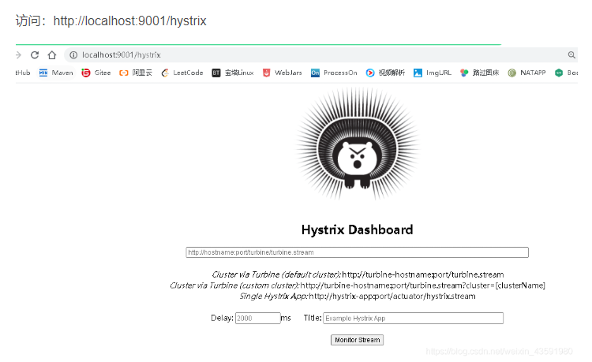

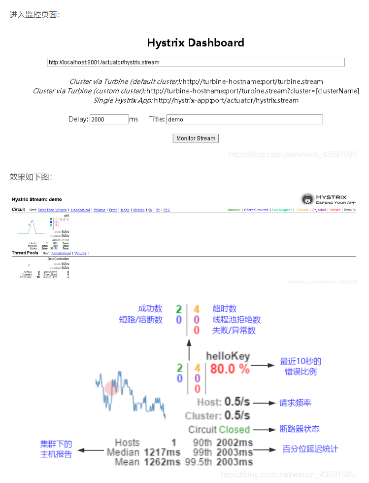

#### 9.Zuul路由网关

狂神：https://www.bilibili.com/video/BV1jJ411S7xr?p=17&spm_id_from=pageDriver


