# 项目构建工具

## 一.maven

### 1.为什么学习maven？

- 在JavaWeb开发中，需要使用大量的jar包，我们手动去导入；
- 如何能够让一个东西自动导入和配置这个jar包。

### 2.maven能做什么？

- 方便导入jar包
- 进行项目架构管理

### 3.maven核心思想

> 约定大于配置

### 4.下载Maven

官网：https://maven.apache.org/

2021年2月19日09:58:00最新版：3.6.3

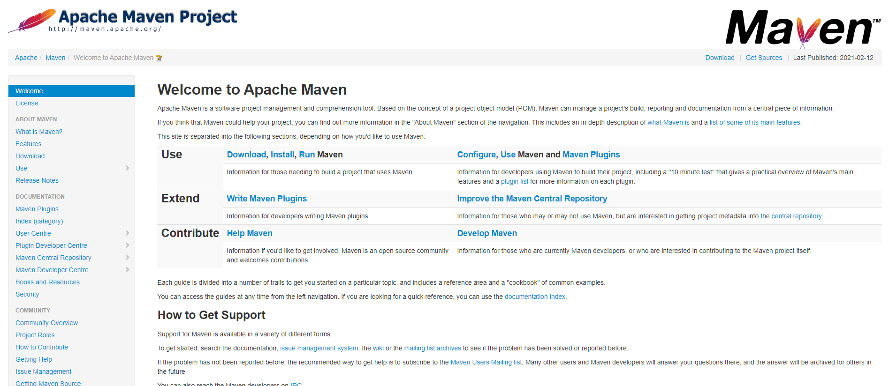

download：

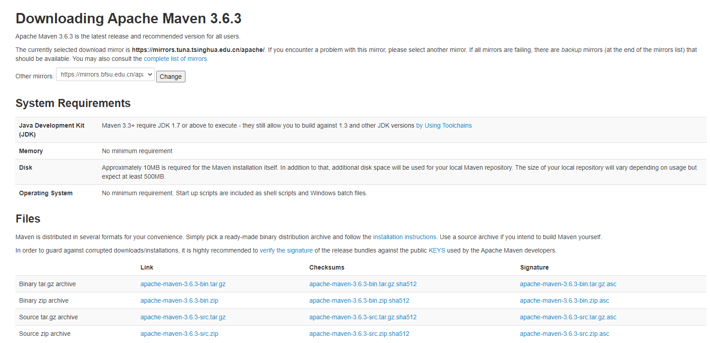

### 5.安装及配置环境变量

系统变量中配置环境变量

- M2_HOME maven目录下的bin目录
- MAVEN_HOME maven的目录
- 在系统的path中配置 %MAVEN_HOME%\bin

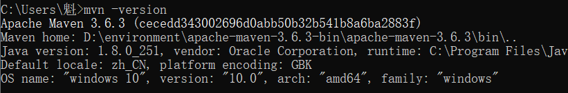

### 6.更改阿里云镜像

阿里云官方指导：https://maven.aliyun.com/mvn/guide

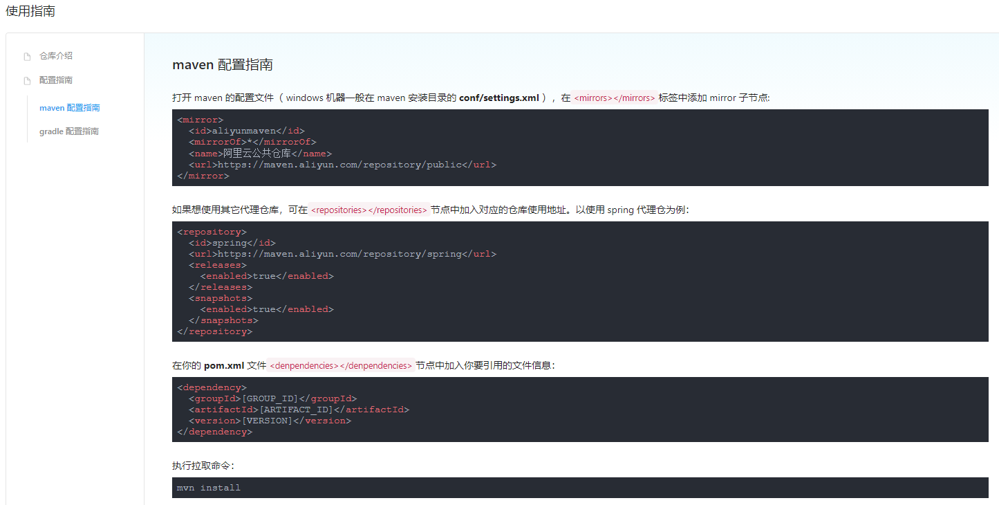

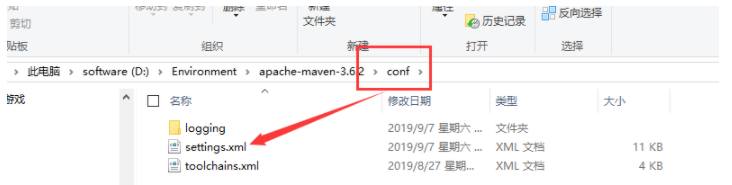

```xml
<mirror>
  <id>aliyunmaven</id>
  <mirrorOf>*</mirrorOf>
  <name>阿里云公共仓库</name>
  <url>https://maven.aliyun.com/repository/public</url>
</mirror>
```

### 7.创建本地仓库

解压包中的setting.xml文件中

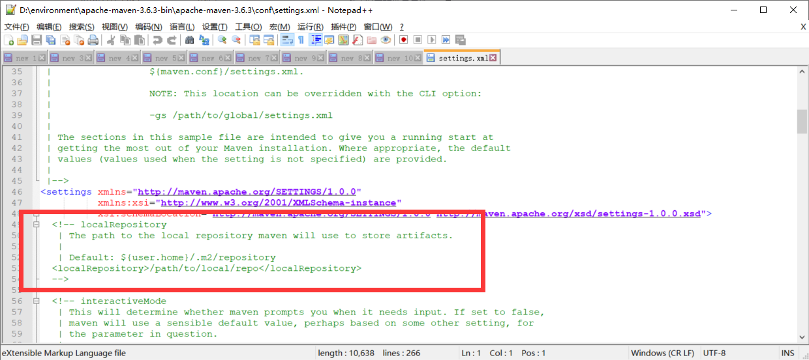

默认创建在C盘的位置

```xml
<localRepository>D:\Environment\apache-maven-3.6.2\maven-repo</localRepository>
```

### 8.IDEA+Maven

**注：**

- Idea自带Maven/gradle等构建工具，且配置均与自定义安装的不同。

#### 1.IDEA构建工具设置

如下图：

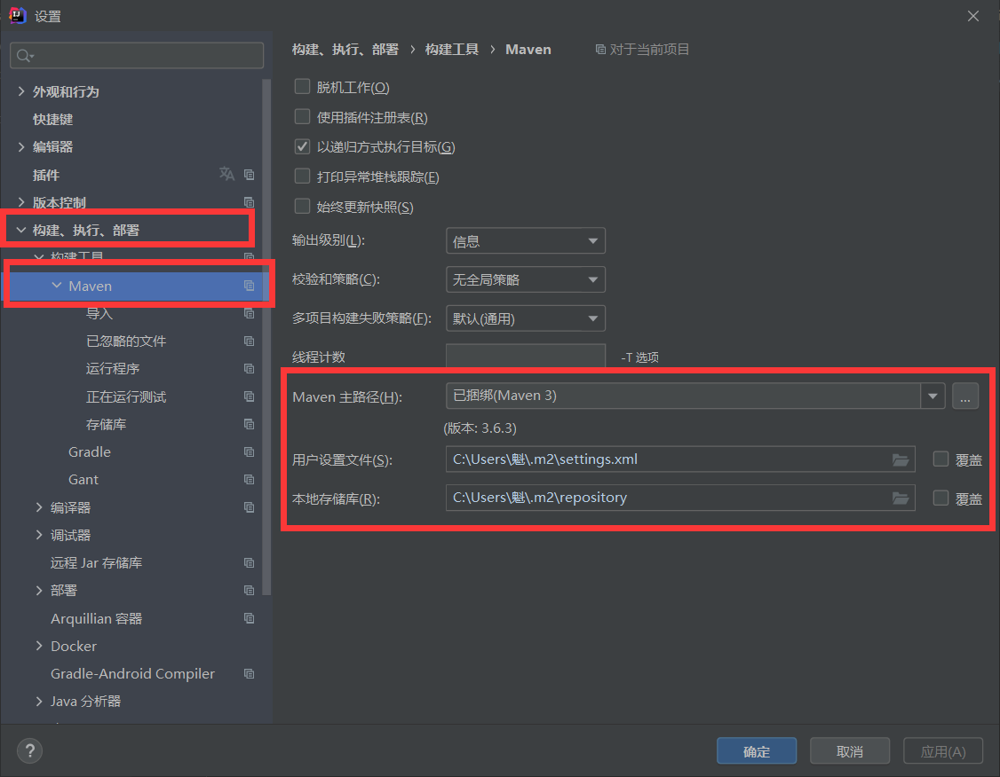

#### 2.其他设置

##### 1.存储库设置：

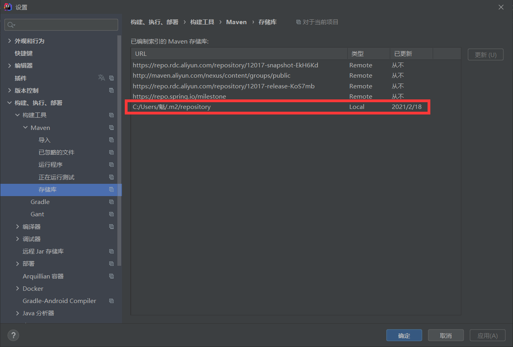

##### 2.导入设置

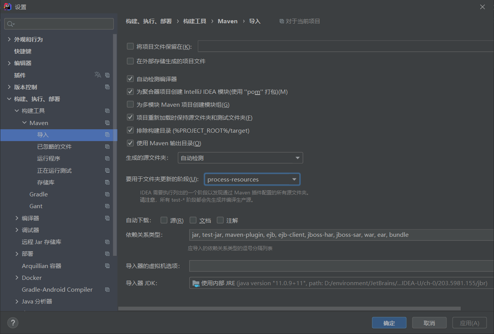

#### 3.观察jar包

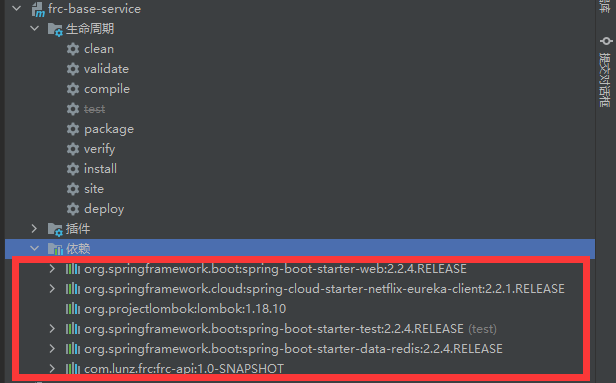

#### 4.出现问题：IDEA会自动修改maven配置

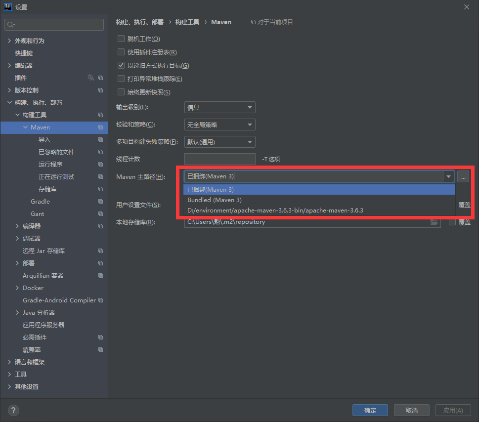

#### 5.标记项目文件资源

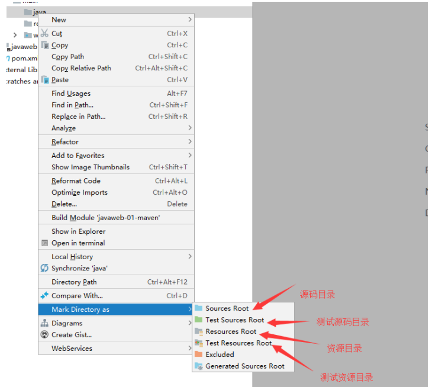

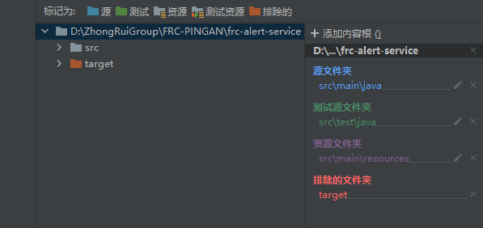

项目结构：

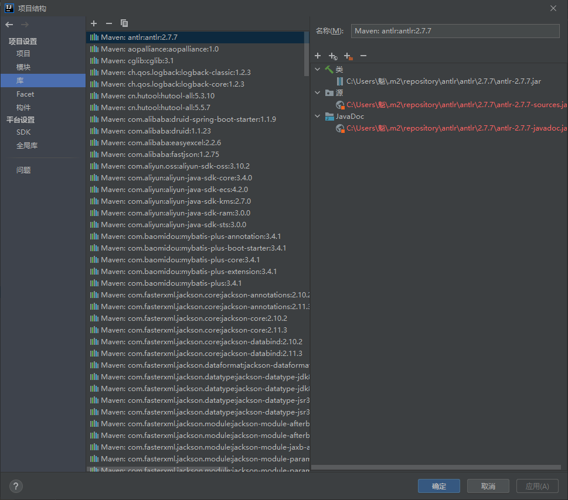

#### 6.Pom.xml文件是maven的核心配置文件

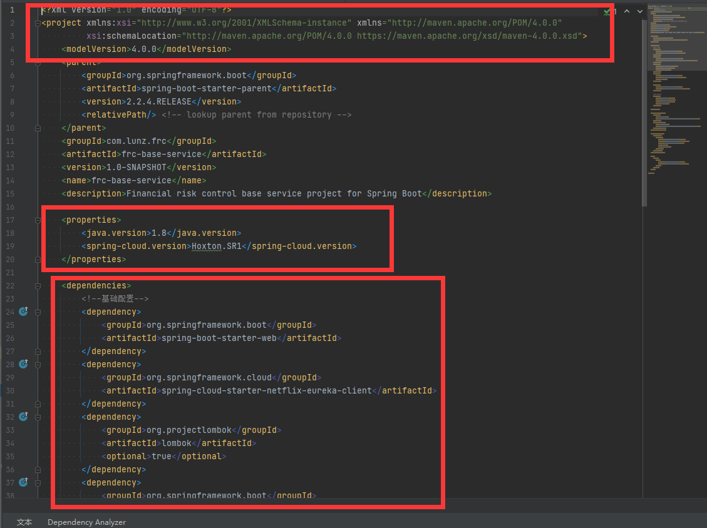

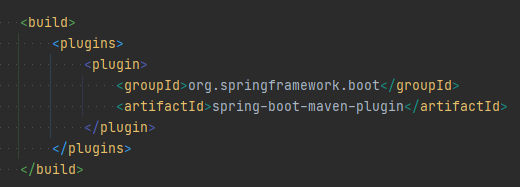

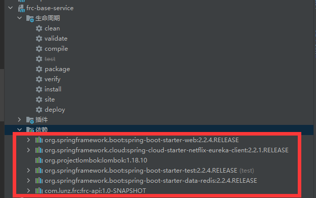

#### 7.IDEA中maven操作

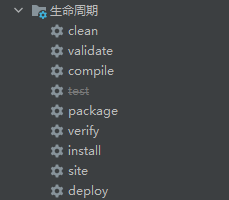

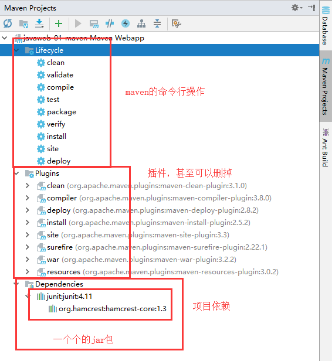

### 9.maven仓库使用

官网：https://mvnrepository.com

活体认证：

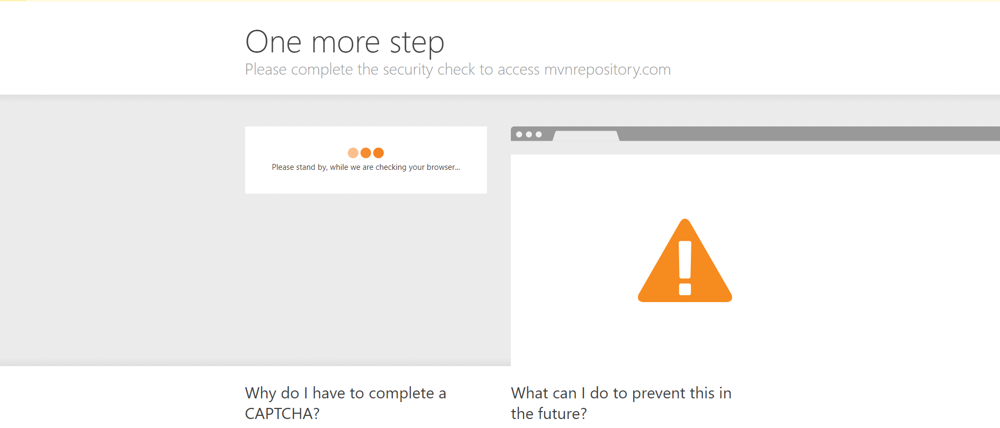

官网：

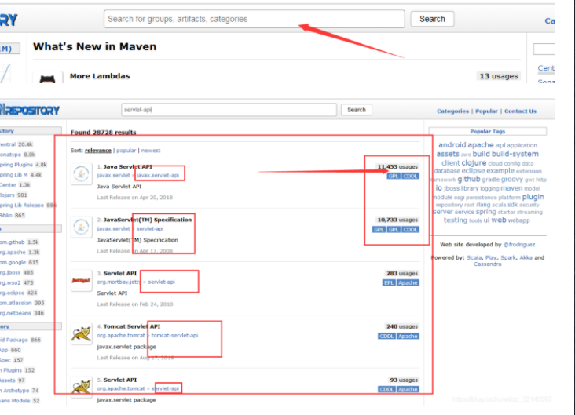

### 10.maven最大优点

- 自动导入此jar包需要的其他jar

可能出现的问题：

- 某个jar包引用的其他jar包会与你直接引用的jar包版本兼容不通，导致导入冲突。

### 11.maven父工程与子工程

> 父工程引用的依赖子工程直接可以引用
>
> 父子工程都有的依赖，子工程优先引用自己的依赖

## 二.gradle

1.简介

> 百度百科
>
> https://baike.baidu.com/item/gradle/3066272?fr=aladdin